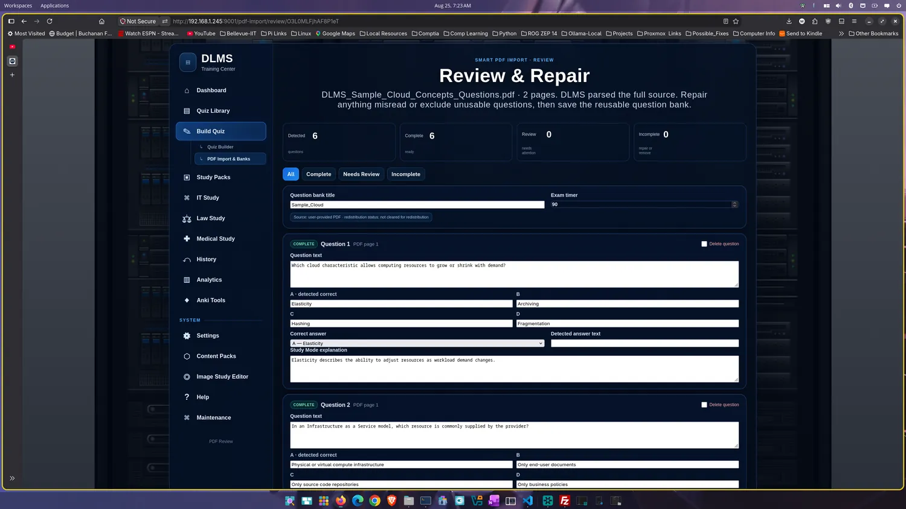
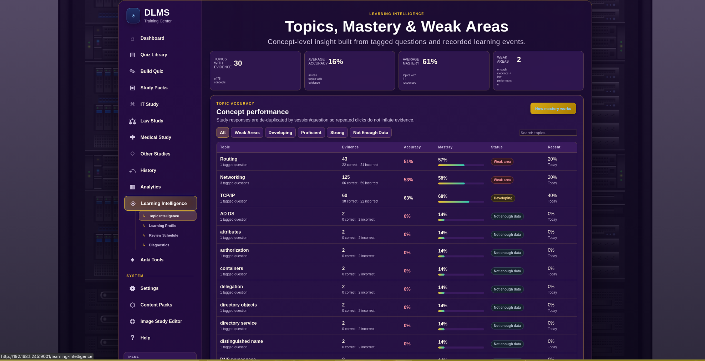
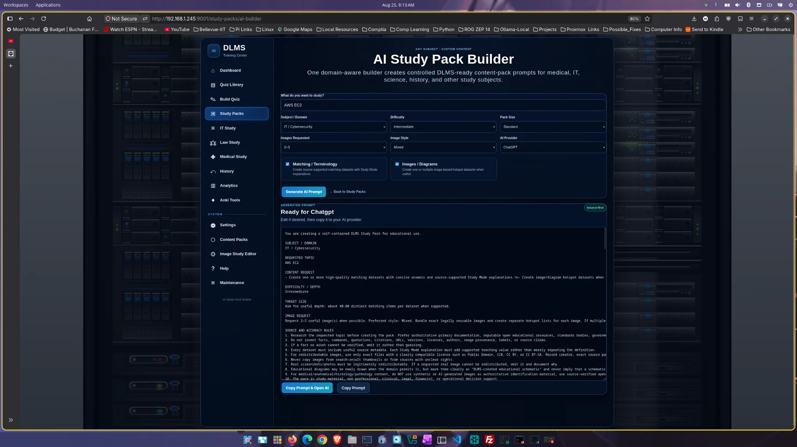

# DLMS

**A private, local-first workspace for building, studying, and improving your
own learning material.**

**Current release: DLMS 3.1.0** · [Download packaged releases](../../releases)

DLMS is a single-user learning-management and study application that runs on
your computer. It combines quiz authoring, document and image import, Study and
Exam modes, learning history, targeted review, reusable Study Packs, and Anki
export in one desktop-style experience. The interface opens in your browser,
while the application and its data remain local by default.

DLMS is an open-source, non-commercial project for personal learning, exam
preparation, technical training, and other self-directed study. It is not a
SaaS product, cloud service, or enterprise multi-user platform.

## Why DLMS

- **Private by default.** No account, hosted database, or cloud deployment is
  required. OCR runs locally in the packaged releases.
- **Built around learning, not only scoring.** Study feedback, concepts,
  confidence, missed-question review, Learning Intelligence, and spaced review
  turn attempts into a practical next-study plan.
- **Flexible input, careful output.** Create material manually or from text,
  PDFs, screenshots, images, matching lists, Study Packs, and structured output
  from an external AI. Ambiguous imports go through Review & Repair instead of
  being silently treated as correct.
- **No required AI API subscription.** DLMS can prepare prompts and validate
  returned content without calling an AI-provider API or storing an API key.
  Using an external provider is optional and remains under the user's control.
- **A desktop-style local experience.** Native packages launch a local Flask
  application and open its browser UI; ordinary use does not require managing a
  separate database or web server.

## Highlights

### Build and import study material

- Create single- or multiple-answer quizzes manually, paste structured text,
  upload question files, or import matching/terminology material.
- Use **PDF & Image Import** for selectable-text question banks and
  glossary/terminology documents.
- Use bundled local OCR for screenshot batches, selected low-text scanned-PDF
  pages, and supported mixed text/raster question layouts.
- Send uncertain PDF, OCR, and structured-AI results through **Review &
  Repair**, where questions, choices, answer mode, explanations, provenance,
  and unassigned text can be inspected before publication.
- Build ordinary image questions and hotspot activities, with non-destructive
  image overlays and editable target regions.

### Study, test, and improve

- Choose **Study Mode** for immediate feedback and explanations, or **Exam
  Mode** for a timed, test-like attempt.
- Resume eligible in-progress Study or Exam sessions after an interruption.
- Review saved attempts, missed questions, scores, pass rates, trends, and
  confidence information through **History** and **Analytics**.
- Attach reusable **concepts** to questions so Learning Intelligence can show
  topic accuracy, evidence, mastery, and weak areas.
- Generate **Smart Review** sets from weak concepts and **Spaced Review** sets
  from due material. Diagnostics can surface recurring choice confusions and
  question-quality signals for inspection.

### Organize and reuse content

- Search, filter, hide, edit, reorder, and organize quizzes into custom folders
  in the **Quiz Library**; export one quiz or a human-readable library reference.
- Install validated **Study Packs** containing matching, multiple-choice,
  mixed, image, or hotspot material. Content Packs can be inspected, exported,
  and moved between DLMS installations.
- Work in dedicated IT, Medical, Law, and Other Studies areas. Law Study also
  supports case-review packets, briefs, Socratic work, IRAC practice, notes,
  flashcards, and exports.
- Create portable backups, validate them before restore, and preserve a safety
  backup while applying a restore.

### Continue outside DLMS

- Build custom Anki decks from selected quiz questions, missed questions, and
  Law Study material.
- Export Anki packages or TSV data, or create printable physical flashcards.
- Export reusable Content Packs and classic quiz text for study or transfer.

### Personal, accessible desktop experience

- Choose Light, Dark, Purple & Gold, or Maroon & Gold themes and customize the
  visible study-area navigation.
- Use semantic controls, visible focus states, keyboard-operable quiz choices,
  and touch/keyboard alternatives for matching activities.
- Keep all active data in the current user's application-data directory, with
  no system-wide database or background service required by default.

## What makes DLMS different

### Import uncertainty stays visible

Document parsing and OCR are probabilistic. DLMS preserves source context,
reports incomplete or low-confidence records, and requires deliberate review
where correctness is not established. That makes imported material repairable
without pretending every extraction is trustworthy.

### Learning Intelligence reuses your own evidence

DLMS connects concept-tagged Study interactions and completed Exam responses to
topic-level views. Smart Review and Spaced Review select from questions you
already own; they do not invent new questions or rewrite recorded answers.

### AI assistance without an embedded provider dependency

The External AI Quiz Builder creates a provider-neutral prompt, accepts bounded
structured quiz output, validates it, and stages it for review. The AI Study
Pack Builder follows a separate prompt → ZIP → validate → install workflow.
DLMS does not send prompts or retrieve responses automatically, so the learner
chooses whether and where external AI is used.

### Reusable sources remain separate from practice copies

Question banks, terminology banks, and Study Packs can generate focused quizzes
without reparsing the original source. This supports repeated practice while
keeping source provenance and installed content manageable.

## Screenshots

These are existing screenshots from the DLMS 3.1.0 Help Center.

| Smart PDF Review & Repair | Learning Intelligence | AI Study Pack Builder |
| --- | --- | --- |
| [](static/help_assets/sample_cloud_questions_smart_pdf_review-repair.webp) | [](static/help_assets/learning-topics.webp) | [](static/help_assets/ai_study_pack_builder.webp) |

## Installation and releases

For normal use, download the package for your operating system from the
[Releases page](../../releases). Every final package contains the native
application, `README.txt`, and `sample_quiz.txt`.

| Platform | DLMS 3.1.0 package |
| --- | --- |
| Fedora 44 x86-64 | `DLMS-3.1.0-fedora44-x86_64.tar.gz` |
| Ubuntu 24.04 x86-64 | `DLMS-3.1.0-ubuntu24.04-x86_64.tar.gz` |
| Ubuntu 26.04 x86-64 | `DLMS-3.1.0-ubuntu26.04-x86_64.tar.gz` |
| Omarchy Quattro x86-64 | `DLMS-3.1.0-omarchy-quattro-x86_64.tar.gz` |
| Windows 11 x86-64 | `DLMS-3.1.0-windows11-x86_64.zip` |
| macOS Apple Silicon (`arm64`) | `DLMS-3.1.0-macos-arm64.zip` |

Linux packages are distribution-specific; use the package named for your
distribution. On Linux or Windows, extract the archive and run the DLMS
executable inside it.

### macOS Apple Silicon

The macOS release is a native application bundle. The macOS ZIP exposes all three directly at
its archive root: `DLMS.app`, `README.txt`, and `sample_quiz.txt`, with no
wrapper directory around the app.

1. Extract `DLMS-3.1.0-macos-arm64.zip`.
2. Drag `DLMS.app` into `/Applications`.
3. Open it from Finder or Applications.
4. Because the release is not Developer ID-signed or notarized, Gatekeeper may
   block its first launch. Where available, Control-click `DLMS.app`, choose
   **Open**, and confirm. Otherwise, try once and then use **System Settings →
   Privacy & Security → Open Anyway**.

Removing quarantine is not part of the normal installation. If those first-run
choices are unavailable, verify the ZIP against `SHA256SUMS.txt` before using
this targeted fallback:

```bash
xattr -dr com.apple.quarantine /Applications/DLMS.app
```

The published macOS package is for Apple Silicon, not Intel.

## Getting started

1. Launch DLMS. In an interactive desktop session it normally opens the local
   interface automatically.
2. If needed, open [http://127.0.0.1:9001/](http://127.0.0.1:9001/) yourself.
3. Start with **Build Quiz**, **PDF & Image Import**, an installed **Study
   Pack**, or one of the subject study areas.
4. Review imported material, then choose Study Mode or Exam Mode.
5. Use History, Analytics, and Learning Intelligence to decide what to revisit;
   send selected material to Anki when useful.

DLMS uses the browser as its interface, but the local application process owns
the session. When finished, use **Shutdown DLMS** in the sidebar for an immediate,
explicit stop. In an eligible loopback-only desktop session, the optional
browser-presence shutdown feature may stop DLMS after the final DLMS browser
presence disappears and its grace period expires. Do not rely on that behavior
when the feature is disabled or DLMS is running in LAN/server mode. If the
process is still running, revisit the local address instead of starting another
server copy.

The included `sample_quiz.txt` is a quick way to try the classic text-import
workflow. DLMS also includes a task-oriented Help Center covering quizzes,
imports, Study Packs, Learning Intelligence, Anki, settings, data management,
and troubleshooting.

## Data, privacy, and portability

DLMS creates its data directory on first run and initializes its local database
and configuration automatically:

- Windows: `%APPDATA%\DLMS`
- macOS: `~/Library/Application Support/DLMS`
- Linux: `~/.local/share/DLMS`

Use **Settings → Backup & Restore** to download a portable backup, validate a
backup before restoring it, or migrate persistent DLMS data. Keep important
backups outside the live application-data directory.

DLMS binds to `127.0.0.1:9001` by default. An intentional non-loopback bind is
an advanced trusted-LAN/server configuration: DLMS has no user authentication,
so it should not be exposed directly to the public internet.

### Browser launch and server controls

- `--browser` forces a browser-launch attempt.
- `--no-browser` suppresses automatic launch.
- `DLMS_NO_BROWSER=1` also suppresses launch and takes precedence over
  `--browser`.
- `--host 0.0.0.0` deliberately enables access through the host's network
  interfaces; use it only on a trusted, appropriately firewalled LAN.

Headless/SSH detection affects automatic browser launch, not the network bind.

## Documentation

- The in-application **Help Center** is the primary user guide.
- [OCR setup and frozen packaging](docs/OCR_PACKAGING.md) explains source-mode
  Tesseract setup and the strict native OCR bundle contract.
- [Native release verification](docs/RELEASE_VERIFICATION.md) documents build,
  artifact, final-package, checksum, and native smoke-test gates.
- [Engineering audit summaries](docs/audits/) record evidence-based product and
  release reviews; they are not third-party certifications or guarantees.

## Development and contributing

Ordinary users should prefer the packaged releases. To run from source:

```bash
python -m venv .venv
source .venv/bin/activate
python -m pip install -r requirements-lock.txt
python app.py
```

On Windows, activate with `.venv\Scripts\activate`. Normal selectable-text PDF
imports work without Tesseract in source mode; screenshot and scanned-page OCR
need the local dependencies documented in
[`docs/OCR_PACKAGING.md`](docs/OCR_PACKAGING.md).

Before proposing a change, keep it focused, preserve local-data compatibility,
and run the relevant tests. The standard non-browser suite is:

```bash
python -m pytest -q -p no:cacheprovider -m "not browser"
```

Compatible dependency ranges are recorded in `requirements.txt`; the verified
3.1.0 environment is pinned in `requirements-lock.txt`. This project is
available under the [MIT License](LICENSE).

<details>
<summary><strong>Maintainer release notes</strong></summary>

### Native build inputs

Build natively on each target from a clean checkout. Prepare the platform-native
OCR bundle described in [`docs/OCR_PACKAGING.md`](docs/OCR_PACKAGING.md), set
`DLMS_TESSERACT_BUNDLE_ROOT`, then use the canonical `DLMS.spec`:

```bash
python -m pip install -r requirements-build.txt
export DLMS_TESSERACT_BUNDLE_ROOT=/absolute/path/to/native-tesseract-bundle
python -m PyInstaller --clean --noconfirm DLMS.spec
```

Verified native inputs use these exact names:

- `DLMS-3.1.0-fedora44-x86_64`
- `DLMS-3.1.0-ubuntu24.04-x86_64`
- `DLMS-3.1.0-ubuntu26.04-x86_64`
- `DLMS-3.1.0-omarchy-quattro-x86_64`
- `DLMS-3.1.0-windows11-x86_64.exe`
- `DLMS-3.1.0-macos-arm64.zip`

On Apple Silicon, verify a native `arm64` Python, build `DLMS.spec`, and create
the verified native-input ZIP with:

```bash
ditto -c -k --sequesterRsrc --keepParent dist/DLMS.app releases/DLMS-3.1.0-macos-arm64.zip
```

The bundle executable is `DLMS.app/Contents/MacOS/DLMS`. Do not place a wrapper
directory around the app or include build/runtime data.

### Final package gate

The six user-facing packages are:

- `DLMS-3.1.0-fedora44-x86_64.tar.gz`
- `DLMS-3.1.0-ubuntu24.04-x86_64.tar.gz`
- `DLMS-3.1.0-ubuntu26.04-x86_64.tar.gz`
- `DLMS-3.1.0-omarchy-quattro-x86_64.tar.gz`
- `DLMS-3.1.0-windows11-x86_64.zip`
- `DLMS-3.1.0-macos-arm64.zip`

Follow [Native Release Verification](docs/RELEASE_VERIFICATION.md) for the exact
artifact and final-package checks, native smoke tests, UAT, and checksum steps.
The tools validate structure, architecture, version, packaged resources,
runtime-data exclusions, start/routes/shutdown/restart behavior, and the final
archive layout. They do not add signing, notarization, installers, publication,
or CI release automation.

GitHub's automatic source archives provide the repository source; do not upload
a separately assembled source ZIP.

</details>

## Project status

DLMS 3.1.0 is the current stable release. The capabilities described above are
present in the 3.1.0 source and packages. Active development may continue on
separate branches, but unreleased roadmap work is intentionally not presented
here as stable functionality.
