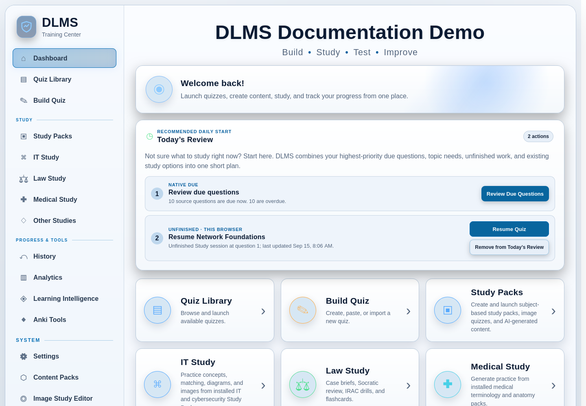

# 3. Interface and Navigation

DLMS uses a consistent desktop-style layout: navigation appears in a sidebar,
and the selected task opens in the main content area. The browser supplies the
window, but the pages belong to the DLMS process running on your computer or on
the trusted LAN host you deliberately connected to.

This chapter introduces the common interface. Later chapters explain how to
organize the Quiz Library, take quizzes, choose a review method, and interpret
Learning Intelligence in depth.

## The Dashboard

The **Dashboard** is the home screen and the best place to reorient yourself.
It has four main roles:

- **Today’s Review** presents a short, prioritized set of useful next actions.
- **Quick Access** opens common destinations such as Quiz Library, Build Quiz,
  Study Packs, History, Analytics, and Settings.
- **Recent Activity** summarizes the latest saved attempts and links to
  History.
- **Overview** shows high-level attempt totals and score summaries.

If your immediate question is “What should I study right now?”, start with
**Today’s Review**. It reuses due-question, concept, adaptive, unfinished, and
recent Study Pack information; it is not a separate scoring system. A new or
low-history installation may show introductory actions until DLMS has enough
saved learning evidence to make more specific recommendations.

*Today’s Review combines server-derived study recommendations with Resume
items marked for this browser.*

Today’s Review only introduces the available actions. The review chapter later
distinguishes Adaptive Study, Smart Review, Concept Review, Due Questions,
Topic Retention Schedule, and missed-question review. In particular, **Due
Questions** schedules individual source questions, while **Topic Retention
Schedule** works at the concept level.

## Use the sidebar

On a wide window, the sidebar remains beside the current page. The active
destination is highlighted. On a narrower window or at high browser zoom, use
the menu button at the top of the page to open the same navigation. You can tab
through its links and controls; pressing Escape closes the open narrow-screen
menu and returns focus to its menu button.

Some destination groups reveal a small submenu while you are working in that
area:

- **Build Quiz** exposes the Quiz Builder and PDF & Image Import paths.
- **Learning Intelligence** exposes Topic Intelligence, Learning Profile,
  Review Schedule, and Diagnostics.
- **Anki Tools** exposes Custom Deck & Printable Cards and Law Study Anki.

The parent destination remains a useful landing page. You do not need to learn
each submenu before beginning a normal quiz.

### Main destinations

| Destination | What you use it for |
| --- | --- |
| **Dashboard** | Start with Today’s Review, use Quick Access, and see recent activity and overview figures. |
| **Quiz Library** | Find, open, edit, organize, export, or manage saved quizzes. Library Tools also opens mixed-quiz, duplicate-review, and portable-bundle workflows. |
| **Build Quiz** | Create material manually or from text, matching data, PDFs, images, OCR, or structured External AI output. |
| **Study Packs** | Browse installed learner-facing collections and generate their supported study activities. |
| **IT Study**, **Law Study**, **Medical Study**, and **Other Studies** | Open subject-focused views. These links can be hidden from the sidebar without deleting their content. |
| **History** | Review saved attempts, results, and missed questions. |
| **Analytics** | See aggregate attempt summaries and performance patterns. |
| **Learning Intelligence** | Understand concept-level learning evidence and open targeted review or scheduling tools. |
| **Anki Tools** | Create `.apkg` decks or printable cards from supported DLMS material. |
| **Settings** | Change appearance, navigation, optional integrations, lifecycle behavior, backups, and carefully scoped data controls. |
| **Content Packs** | Validate and manage the packaged sources behind learner-facing Study Pack activities. |
| **Image Study Editor** | Maintain image overlays and hotspot regions for supported image-study content. |
| **Help** | Open task-oriented guidance and specialized reference pages. |

Settings, Content Packs, and Image Study Editor appear in the system portion of
the navigation because they are not normal daily-study destinations. More
consequential maintenance actions—including **Rebuild All Quiz Pages**—belong
under Settings and System Tools. Rebuild is an occasional recovery tool, not a
routine step after every update.

## Customize visible study areas

Open **Settings → Navigation**, or select **Customize navigation** in the
sidebar, to show or hide IT Study, Law Study, Medical Study, and Other Studies.
All four are enabled by default on a new configuration.

This changes navigation only. Hiding a study area does not delete or disable
its quizzes, Study Packs, cases, History, Analytics, or saved direct links. You
can restore its sidebar entry at any time. Study Packs and Settings remain
available.

The subject pages contain different material only when the corresponding
content has been installed or created. A visible destination does not imply
that its catalog is already populated.

## Choose an appearance

The sidebar’s compact **Theme** selector provides a quick way to switch among:

- Dark;
- Light;
- Purple & Gold; and
- Maroon & Gold.

For the full appearance settings, open **Settings → Appearance**. There you can
also change the Dashboard title and choose a background image. Appearance
changes presentation only; they do not change quiz content, grading, History,
or Learning Intelligence.

DLMS pages adapt to narrower content areas. Cards and controls wrap or stack,
the sidebar moves behind the menu button, and dense tables may provide their
own horizontal scrolling so important actions remain reachable. If content
seems unusually cramped, use the page’s own scrolling area rather than reducing
browser zoom until text becomes difficult to read.

## Recognize common interface patterns

### Cards and panels

Dashboard actions, Library tools, settings areas, and many builders are shown as
cards or panels. A linked card opens the task named by its heading. Informational
panels may summarize state without being clickable, so use the labeled button
or link inside them when one is provided.

### Badges and status labels

Badges identify states such as review status, Generated Practice type, or
completion. Read the badge text rather than relying on color alone. The Quiz
Library gives Generated Practice and reusable **Mixed Quiz** compositions
different labels. Creating either one leaves its source quizzes unchanged. See
[Quiz Library and Organization](05-quiz-library-and-organization.md#recognize-generated-practice)
for the full distinction.

### Notices, errors, and confirmations

Success, warning, error, and progress notices describe what DLMS accepted or
what still needs attention. Import and repair screens may label records as
complete, needing review, incomplete, or unassigned. These labels are part of
the safety workflow; do not assume an import is finished merely because some
text was extracted.

DLMS asks for confirmation before consequential actions such as publishing
uncertain imported material, replacing data during restore, deleting content,
or resetting persistent state. Read the stated scope before confirming. If a
save or import fails, follow the displayed recovery action rather than closing
the page and assuming the change succeeded.

## Unfinished work and “This browser”

An interrupted quiz can produce a Resume item marked **This browser**. It is a
checkpoint in the current browser profile, not a completed History record or a
session synchronized to other browsers. Use **Start Over** only when you intend
to discard that recoverable progress.

Quizzes, completed History, and server-derived learning information still come
from the DLMS host. The completion and cross-client recovery contract is
explained in [Taking Quizzes](06-taking-quizzes.md#resume-an-interrupted-quiz).

## Use Help when you need task detail

Open **Help** from the system navigation for the Help Center. Its topic cards
cover getting started, quizzes, builders, External AI, PDF and OCR workflows,
Study Packs, subject areas, content management, History and Analytics, Learning
Intelligence, Anki, settings, maintenance, and troubleshooting.

Some workflows also provide contextual Help that returns you to the current
task. Advanced parsing and regular-expression guidance lives in specialized
Help pages so it does not crowd the normal creation workflow.

The Help Center is useful for a concise procedure. This manual provides the
larger product model, cross-workflow distinctions, and reference detail.

## Common places to go

| If you need to… | Go to… |
| --- | --- |
| Decide what to study now | **Dashboard → Today’s Review** |
| Find or open an existing quiz | **Quiz Library** |
| Create or import study material | **Build Quiz** |
| Use installed subject collections | **Study Packs** or the relevant visible study area |
| Review a completed result or missed questions | **History** |
| See performance across attempts | **Analytics** |
| Understand concepts or choose a specialized review | **Learning Intelligence** |
| Review individually scheduled questions | **Learning Intelligence → Review Schedule → Due Questions** |
| Review concept-level retention timing | **Learning Intelligence → Review Schedule → Topic Retention Schedule** |
| Export Anki material or printable cards | **Anki Tools** |
| Change the theme or visible study areas | **Settings → Appearance** or **Settings → Navigation** |
| Back up or restore DLMS data | **Settings → Backup & Restore** |
| Get task-specific guidance | **Help** |

Once these destinations are familiar, continue with the chapter for the task
you want to complete. You can always return to the Dashboard through the first
sidebar link.
