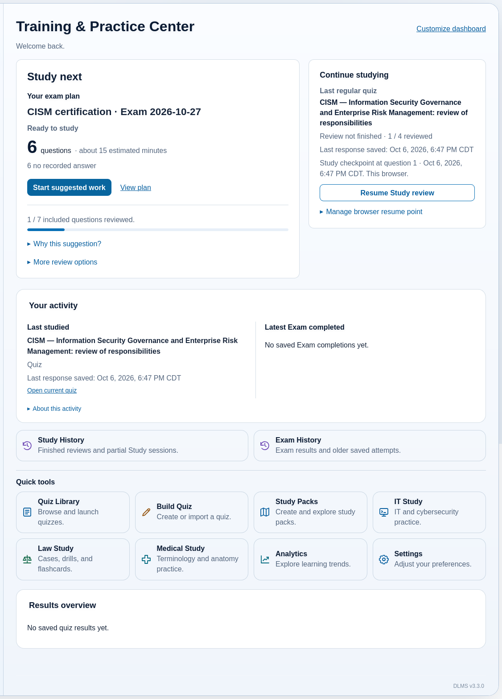

# 3. Interface and Navigation

DLMS uses a consistent desktop-style layout: navigation appears in a sidebar,
and the selected task opens in the main content area. The browser supplies the
window, but the pages belong to the DLMS process running on your computer or on
the trusted LAN host you deliberately connected to.

This chapter introduces the common interface. Later chapters explain how to
organize the Quiz Library, take quizzes, choose a review method, and interpret
Learning Intelligence in depth.

## The Dashboard

Start with **Study next**. It makes one suggested action prominent, with a short
reason and **Why this suggestion?** for detail. An active Exam Plan can guide
that action; **More review options** reveals eligible due, concept or Adaptive
Study alternatives. A request error is not a valid “no suggestions” result.

**Continue studying** keeps your last regular quiz separate from generated
practice. A durable Study response establishes that reference; opening a quiz
alone does not. A confirmed finished review offers **Open current quiz**, not
Resume. Actual unfinished work can offer **Resume**, while pending or failed
saves take priority through **Resolve Study saves** or **Finish saving Exam**.

**Your activity** contains **Continue your quiz sequence** and **Latest Exam
completed**. After acknowledged Finish Review for unchanged regular material,
the sequence offers the next regular quiz in the same folder's saved Quiz Library
order. Generated practice never replaces the anchor; already-reviewed quizzes
are not skipped. It does not jump folders. Opening a link earns no credit.

Use the independent **Study History** and **Exam History** shortcuts. **Quick
tools** keeps optional shortcuts compact. **Results overview** summarizes saved
Exam and legacy Study scores, not durable Study coverage. No saved results does
not mean your Study work is missing. **My Certifications** displays earned
credentials, including expired achievements; exam preparation belongs in Exam Plans.

*Disposable sample data. Open warnings before starting more work; secondary
review options and historical records remain separate from the main suggestion.*

See [Study and Review](07-study-and-review.md), [Exam Plans](exam-plans.md) and
[History](09-history-results-and-progress.md) for the different evidence meanings.

## Use the sidebar

On a wide window, the sidebar remains beside the current page. The active
destination is highlighted. On a narrower window or at high browser zoom, use
the menu button at the top of the page to open the same navigation. You can tab
through its links and controls; pressing Escape closes the open narrow-screen
menu and returns focus to its menu button.

Some destination groups reveal a small submenu while you are working in that
area:

- **Build Quiz** exposes the Quiz Builder and PDF & Image Import paths.
- **Learning Intelligence** exposes Topic Intelligence, Learning Profile,
  Review Schedule, Diagnostics and Exam Plans.
- **My Certifications** includes the reusable Training library when the feature is shown.
- **Anki Tools** exposes Custom Deck & Printable Cards and Law Study Anki.

The parent destination remains a useful landing page. You do not need to learn
each submenu before beginning a normal quiz.

### Main destinations

| Destination | What you use it for |
| --- | --- |
| **Dashboard** | Start with Study next, continue saved work, and open separate histories. |
| **Quiz Library** | Find, open, edit, organize, export, or manage saved quizzes. Library Tools also opens mixed-quiz, duplicate-review, and portable-bundle workflows. |
| **Build Quiz** | Create material manually or from text, matching data, PDFs, images, OCR, or structured External AI output. |
| **Study Packs** | Browse installed learner-facing collections and generate their supported study activities. |
| **IT Study**, **Law Study**, **Medical Study**, and **Other Studies** | Open subject-focused views. These links can be hidden from the sidebar without deleting their content. |
| **Exam History** | Review saved Exam and clearly labeled legacy Study results. Study History is a separate dashboard shortcut. |
| **Analytics** | See aggregate attempt summaries and performance patterns. |
| **Learning Intelligence** | Understand concept-level learning evidence and open targeted review or scheduling tools. |
| **Anki Tools** | Create `.apkg` decks or printable cards from supported DLMS material. |
| **Settings** | Change appearance, navigation, optional integrations, lifecycle behavior, backups, and carefully scoped data controls. |
| **Content Packs** | Validate and manage the packaged sources behind learner-facing Study Pack activities. |
| **Image Study Editor** | Maintain image overlays and hotspot regions for supported image-study content. |
| **Help** | Open task-oriented guidance and specialized reference pages. |

Settings, Content Packs, and Image Study Editor appear in the system portion of
the navigation because they are not normal daily-study destinations. More
consequential maintenance actions—including **Rebuild All Quiz Pages**—belong
under Settings and System Tools. Rebuild is an occasional recovery tool, not a
routine step after every update.

## Customize visible study areas

Open **Settings → Layout & navigation**. IT, Law and Medical each have independent
**Show on dashboard** and **Show in sidebar** choices. **Hide from both** changes
the form; **Save layout & navigation** persists it. Other Studies is sidebar-only.
Dashboard panels and remaining shortcuts have their own controls on this page.

**Restore dashboard defaults** and **Restore sidebar defaults** apply immediately,
each to its own mapping. Confirm discarding unsaved edits when prompted. Hiding
content never deletes it or changes Learning Scope. Settings remains reachable
when every optional dashboard section is hidden; there is no Dashboard Customize
link to find. The separate **Show My Certifications** switch also hides that
feature's sidebar links, including Training library, without deleting its data.

See [Settings and Runtime](16-settings-and-runtime.md).

## Choose an appearance

Select a theme in the sidebar to apply and save it immediately, or open
**Settings → Appearance**, choose **Color theme**, then **Save Appearance**.
The 26 manual choices are grouped as DLMS, Omarchy · Light and Omarchy · Dark.
The existing adapted Ethereal remains one choice, not an exact copy of every
upstream detail. Omarchy installation or automatic desktop matching is not needed.

An already-open tab may need a reload to use a change made elsewhere. Shared-CSS
quiz pages use the current theme; older self-contained HTML may need an explicit
owner-controlled rebuild. Theme changes do not change grades or learning evidence.
For current names/classifications and readability guidance, use the registry-fed
reference in **Help → Settings → Appearance**.

## Recognize common interface patterns

### Cards and panels

Dashboard actions, Library tools, settings areas, and many builders are shown as
cards or panels. A linked card opens the task named by its heading. Informational
panels may summarize state without being clickable, so use the labeled button
or link inside them when one is provided.

### Badges and status labels

Badges identify states such as review status, Generated Practice type, or
completion. Read the badge text rather than relying on color alone. The Quiz
Library gives Generated Practice and reusable **Mixed Quiz** compositions
different labels. Creating either one leaves its source quizzes unchanged. See
[Quiz Library and Organization](05-quiz-library-and-organization.md#recognize-generated-practice)
for the full distinction.

### Notices, errors, and confirmations

Success, warning, error, and progress notices describe what DLMS accepted or
what still needs attention. Import and repair screens may label records as
complete, needing review, incomplete, or unassigned. These labels are part of
the safety workflow; do not assume an import is finished merely because some
text was extracted.

DLMS asks for confirmation before consequential actions such as publishing
uncertain imported material, replacing data during restore, deleting content,
or resetting persistent state. Read the stated scope before confirming. If a
save or import fails, follow the displayed recovery action rather than closing
the page and assuming the change succeeded.

## Unfinished work and “This browser”

An interrupted quiz can produce a Resume item marked **This browser**. It is a
checkpoint in the current browser profile, not a completed History record or a
session synchronized to other browsers. Use **Start Over** only when you intend
to discard that recoverable progress.

Quizzes, completed History, and server-derived learning information still come
from the DLMS host. The completion and cross-client recovery contract is
explained in [Taking Quizzes](06-taking-quizzes.md#resume-an-interrupted-quiz).

## Use Help when you need task detail

Open **Help** from the system navigation for the Help Center. Its topic cards
cover getting started, quizzes, builders, External AI, PDF and OCR workflows,
Study Packs, subject areas, content management, History and Analytics, Learning
Intelligence, Anki, settings, maintenance, and troubleshooting.

Some workflows also provide contextual Help that returns you to the current
task. Advanced parsing and regular-expression guidance lives in specialized
Help pages so it does not crowd the normal creation workflow.

The Help Center is useful for a concise procedure. This manual provides the
larger product model, cross-workflow distinctions, and reference detail.

## Common places to go

| If you need to… | Go to… |
| --- | --- |
| Decide what to study now | **Dashboard → Study next** |
| Find or open an existing quiz | **Quiz Library** |
| Create or import study material | **Build Quiz** |
| Use installed subject collections | **Study Packs** or the relevant visible study area |
| Review a completed result or missed questions | **History** |
| See performance across attempts | **Analytics** |
| Understand concepts or choose a specialized review | **Learning Intelligence** |
| Review individually scheduled questions | **Learning Intelligence → Review Schedule → Due Questions** |
| Review concept-level retention timing | **Learning Intelligence → Review Schedule → Topic Retention Schedule** |
| Export Anki material or printable cards | **Anki Tools** |
| Change the theme or visible study areas | **Settings → Appearance** or **Settings → Layout & navigation** |
| Back up or restore DLMS data | **Settings → Backup & Restore** |
| Get task-specific guidance | **Help** |

Once these destinations are familiar, continue with the chapter for the task
you want to complete. You can always return to the Dashboard through the first
sidebar link.
