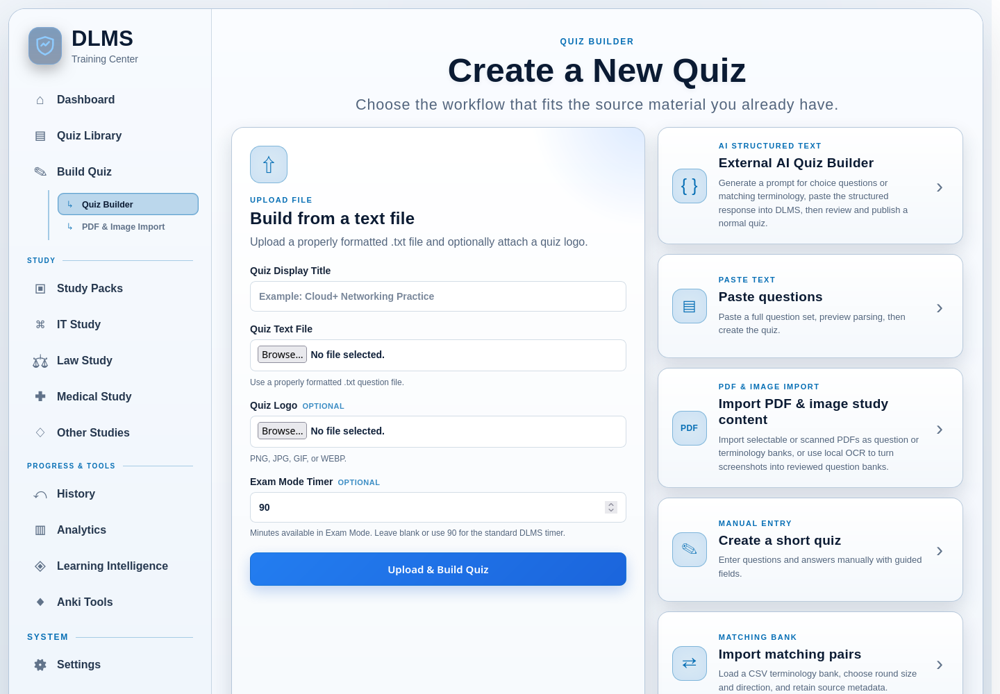

# 4. Creating and Importing Content

DLMS gives you several ways to turn material into something you can study. You
can type a small quiz yourself, import structured text or matching pairs, work
from PDFs and images, or bring in reviewed content from an external tool. You
do not need to learn every workflow. Choose the one that best matches the
material you already have.

Most quiz-building paths begin at **Build Quiz** in the sidebar. Portable Quiz
Bundles are imported from **Quiz Library → Quiz Bundles**, while Study Packs
are installed and managed through the pack screens.



## Choose a creation method

| If you have… | Consider using… | What to expect |
| --- | --- | --- |
| A few questions you want to type | **Create a short quiz** | Enter choice or matching questions in guided fields, then create and edit the quiz. |
| A formatted `.txt` question file | **Build from a text file** | Supply a title, optional logo and Exam Mode timer, then let DLMS parse and publish the choice questions. |
| Structured questions copied from another source | **Paste questions** | Clean and preview the text before building the quiz. |
| A CSV list of terms and definitions | **Import matching pairs** | Create a matching quiz with a chosen direction and pairs-per-round setting. |
| A selectable PDF question bank or terminology list | **Import PDF & image study content** | Extract the document into a reviewed Question Bank or Terminology Bank. |
| Scanned pages or screenshots | **PDF & Image Import** with local OCR | Extract candidate questions or term/definition pairs, then correct them in Review & Repair. |
| Structured choice or matching content from a conversational AI | **External AI Quiz Builder** | Generate a prompt, use the provider outside DLMS, paste its JSON response back, and review it before publication. |
| Images that should accompany questions or contain clickable regions | **Build from image(s)** | Create image-backed choice, matching, or hotspot material in an image Study Pack and quiz. |
| Quizzes exported from another DLMS installation | **Quiz Bundles** | Validate and preview a Portable Quiz Bundle before importing its ordinary quizzes. |
| A reusable packaged collection | **Content Packs** | Validate and install the package, then use its learner-facing activities under Study Packs or a subject area. |

Use material only when you have permission to do so. PDF, OCR, image, and pack
workflows may ask you to confirm that right explicitly. You are also
responsible for checking the educational accuracy of imported material.

## Create a quiz directly

The **Create a Short Quiz** workflow is the simplest choice when you want full
control over a modest set of questions.

### Start the builder

1. Open **Build Quiz** and choose **Create a short quiz**.
2. Enter how many question blocks you want to start with. You can choose from
   1 to 100; the default is 10.
3. Choose **Start Quiz Builder**.
4. Enter a **Quiz Display Title**. The title identifies the quiz in the Quiz
   Library and when you open it.
5. Optionally attach a PNG, JPG, GIF, or WEBP logo.
6. Set the **Exam Mode Timer** if you want a duration other than the standard
   90 minutes. The supported range is 1 to 1,440 minutes.

The starting question count is only a convenience. Use **Add New Question** or
the delete control on a question to change the set while you work. DLMS keeps
at least one question block in the builder.

### Add choice questions

Leave **Question Type** set to **Multiple Choice / Multi-Select**, then enter
the question text and its possible answers.

Choice questions start with four answer slots. You can use from 1 to 26
nonblank choices and must mark at least one as correct. Mark one correct answer
for a single-answer question, or mark multiple correct answers to create a
multi-select question. Blank unused answer rows are ignored.

There is no separate single-answer or multi-select mode selector. The number
of answers marked **Correct** determines how the question behaves. Use **Add
Choice** to add rows and the delete control beside a row to remove one. DLMS
does not let a choice question lose its final answer row.

Before creating the quiz, DLMS checks that each entered question has text, at
least one nonblank answer, and at least one marked correct answer. Marking an
empty row as correct is also an error. Correct the highlighted or described
problem and submit again; unused blank rows do not need to be deleted.

### Add matching questions

Set **Question Type** to **Matching** when the learner should pair left-hand
items with their corresponding right-hand items. Enter instructions such as
“Match each term with its definition,” then complete at least two pairs.

The matching editor starts with four pair rows. Blank rows are ignored, but a
row with only one side filled is incomplete and must be finished or removed.
Use **Add Pair** and the delete control to adjust the list. A matching question
must retain at least two complete, nonconflicting pairs.

You can also choose:

- **Pairs Per Round** — leave this blank to use every pair, or enter how many
  should appear in one attempt; and
- **Direction** — use **Term → Definition**, **Definition → Term**, or **Random
  Each Attempt**.

Matching is a distinct question type. It does not use correct-answer
checkboxes because the pairs themselves define the expected matches.

### Create and review the result

Choose **Create Quiz** when the set is ready. If validation succeeds, DLMS
saves the quiz and opens its editor. This gives you an opportunity to inspect
the result, adjust the title or timer, edit questions, and add optional Study
Mode explanations or concept tags. Saving edits refreshes the playable quiz.

Concept tags are most useful when you apply the same concise name to questions
that test the same idea. Learning Intelligence and other study tools can then
recognize that concept across quizzes. Concept behavior is explained in the
Learning Intelligence chapter.

## Import structured choice-question text

Use traditional Parsing when you already have choice questions and known answer
keys in structured text. It is a direct, local way to create a quiz without
retyping each question into the manual builder.

> Parsing was one of DLMS's foundational workflows. The earliest recoverable
> version converted structured question text from uploaded files into interactive
> quizzes, and pasted-text creation followed shortly afterward. Today, this is
> one of several ways to bring content into DLMS.

### Prepare the question structure

Keep a numbered start for each question, such as `1.`, `2)`, or `Question #3`.
Use lettered choices such as `A.` or `A)`, followed by a space and the answer
text. End each question with an explicit `Correct Answer:` or
`Suggested Answer:` line. A single answer uses one letter; multiple answers use
adjacent letters such as `AC`. A bare letter or `Answer: B` is not recognized
as the answer marker.

This original two-question example includes a repeated label to remove:

```text
Practice copy
1. Which file contains plain text?
A. notes.txt
B. photo.png
Correct Answer: A
Practice copy
2. Which actions preserve another copy of your work?
A. Create a backup
B. Delete the only copy
C. Export a portable quiz bundle
Correct Answer: AC
```

### Build from a text file

Use **Build from a text file** for an already formatted UTF-8 `.txt` file.

1. Enter a **Quiz Display Title** and choose the file (up to 16 MiB).
2. Optionally add a logo and set the Exam Mode timer.
3. Choose **Upload & Build Quiz**.
4. In Quiz Library, open the quiz, check the question count, and verify its answers.

File import parses and publishes directly; it does not run the paste-preview
cleanup tools. Remove repeated labels from the file first, or use Paste questions
to preview that cleanup. Renaming a PDF to `.txt` does not convert it.

### Create from pasted text

1. Open **Build Quiz → Paste questions**.
2. Enter **Structured Text Practice** as the title and paste the example above.
   Optionally change the timer (the tutorial uses 15 minutes) or add a logo.
3. In **Remove Unwanted Lines**, enter `Practice copy`. This is a case-insensitive
   substring match: it removes the **entire matching line**. Choose specific text
   so useful question or answer lines are not removed accidentally.
4. Leave the built-in presets unchecked for this example. They work independently
   of manual regex settings, but this source does not need wrapping or header
   repairs. **Keep question numbering.** Explicit number-prefix removal remains
   available for advanced cleanup, with a warning that it can merge questions.
5. Choose **Preview & Continue**. Compare **Original Text** with **Text To Be
   Parsed**. Both numbered questions and their answer keys should remain;
   the repeated `Practice copy` lines should be gone.
6. Optionally open **Show / Hide Differences** to see changed lines, or **Show /
   Hide Invisible Characters** to inspect hidden characters when that tool is
   enabled. **Download Cleaned Text** saves a reusable text copy.
7. Treat **Formatting Suggestions** and **Confidence Analysis — Format Only**
   as hints about structure. They do not verify facts or correct answers.
   **Apply This Fix** re-previews the original source with the selected cleanup,
   retaining the title, timer, temporary logo and existing cleanup selections.
8. Choose **Yes, Build My Quiz** when the cleaned source is ready. This is where
   the actual parser and publication workflow run. Preview alone has not created
   final parsed question records or a quiz.
9. In **Quiz Library**, choose **Open Quiz** and verify that the result contains
   **two questions**. Use Study Mode to check the first answer (`A`) and both answers
   for the second question (`A` and `C`). Use the quiz editor to inspect or
   correct the result before relying on it for study.

Manual regex replacements are optional and enabled separately in
[Parsing Settings](16-settings-and-runtime.md#configure-text-parsing-tools).
Rules use `REGEX => REPLACEMENT`; broad rules can remove meaningful content.
Preview every change rather than applying cleanup simply because it is available.

### Check the result and choose the right input path

Traditional Parsing is designed for consistent choice-question text:

- Blank lines alone are not reliable separators between multiple questions.
  Retain numbered boundaries.
- Write `Correct Answer: AC`, not `Correct Answer: A, C`; comma-separated
  keys are not equivalent and may retain only the first letter.
- Keep each choice on one line where possible. Wrapped choice continuation text
  may not be retained reliably.
- Blocks with missing recognized answer keys or fewer than two choices may be
  skipped. If nothing parses, DLMS provides a failure page and downloadable parse
  log. If only some blocks parse, a quiz may still be created: compare its count
  with your source and check every answer key.
- Use one unambiguous answer line per question, with letters that exist among
  its choices. Format confidence is not a correctness guarantee.
- Traditional text parsing does not create structured explanations, matching
  pairs, hotspot regions or rich image metadata. Add supported details in the
  editor, or choose a better-suited creation method.

Use [PDF/OCR and Review & Repair](10-pdf-smart-pdf-and-ocr.md) for document
extraction and uncertain recovered content; [External AI](12-external-ai-workflows.md)
for reviewed structured returned content; matching CSV for terminology pairs;
and the image builder for image/hotspot material. Reusable datasets belong in
[Study Packs / Content Packs](13-study-packs-and-content-packs.md).

The supplemental [Parsing tutorial source and review status](../demo-video/series/parsing-pasted-text/README.md)
follows this same example. The written instructions above are complete without it.

## Import a matching CSV

Use **Import matching pairs** when you have a spreadsheet-style terminology
list rather than choice questions. Save or export the source as UTF-8 CSV with
headers `term,definition`. The aliases `left,right` are also accepted.

Enter a quiz title, select the CSV, choose a pairs-per-round value from 2 to
100, and select the direction. The round size is reduced to the number of
available pairs when necessary. You may customize the matching instructions
and, for third-party or distributable material, record optional organization,
dataset, version, license, and source-URL information.

Rows without both a term and a definition are skipped. DLMS rejects an
unreadable file, missing headers, conflicting usable pairs, or a bank with
fewer than two usable pairs after those rows are skipped. After a successful
import, the matching quiz opens in the quiz editor.

## Create image-based material

**Build from image(s)** is a separate image-study workflow. It can place an
image above ordinary choice or matching questions, or define a hotspot question
whose answer is a region of the image. The workflow asks you to confirm that
you have permission to use the uploaded images and records the generated pack
as user-supplied material.

[Matching, Terminology, and Image-Based Content](11-matching-terminology-and-image-based-content.md)
explains image preparation, clickable-region editing, and keyboard use. Use
that path instead of trying to represent an image region as a text answer.

## Understand import and staging workflows

Some acquisition paths create a normal quiz immediately. Others first create a
bank, staged draft, or installed content source from which a quiz can be
published or generated.

### PDF, Smart PDF, and OCR

Use **PDF & Image Import** for selectable PDFs, scanned pages, screenshots, and
terminology material. Smart PDF examines document structure and may offer
local OCR for scanned pages or carefully bounded missing raster content. It is
not a promise that every arbitrary page layout can be understood.

Question and terminology extraction normally leads to Review & Repair and then
to a reusable Question Bank or Terminology Bank. You can generate playable
practice from that bank without discarding the reviewed source. OCR-assisted
matching can instead publish reviewed term/definition pairs as normal matching
content. [PDF, Smart PDF, and OCR](10-pdf-smart-pdf-and-ocr.md) provides the
complete procedures.

### External AI structured content

The **External AI Quiz Builder** supports choice questions and
matching/terminology. DLMS creates a bounded prompt; you copy it to a
conversational AI outside DLMS, then paste the structured JSON response back.
DLMS does not contact the provider or require an API key.

Returned content is untrusted input. It must pass validation and Review &
Repair before it becomes a normal quiz. This is separate from the AI Study Pack
workflow, in which an external provider prepares a ZIP package for DLMS to
validate and install.

### Study Packs, Content Packs, and portable quizzes

A **Study Pack** is a learner-facing collection that can offer matching, quiz,
image, or hotspot activities. **Content Packs** is the management area for
validating, installing, inspecting, exporting, or removing the source packages
that provide those activities. They are not ordinary Quiz Library folders.

A **Portable Quiz Bundle** is narrower: it moves selected ordinary quizzes and
supported media between DLMS installations without carrying personal learning
history. Import it from **Quiz Library → Quiz Bundles**, review the validation
preview and any collision renames, then confirm. The import, export, and
portability chapter explains what each format preserves.

## Review & Repair before publication

**Review & Repair** is the shared safety stage for automatically extracted or
externally produced material. It is not yet the finished quiz.

The exact controls depend on the source, but the workflow may let you:

- correct question, choice, term, or definition text;
- add, remove, or reorder answers and pairs;
- choose or correct the answer mode;
- mark the complete set of correct answers;
- include usable records and exclude unusable ones;
- retain uncertain or unassigned text while you decide what it means; and
- confirm each final question or pairing before publication.

Editing a confirmed record can require you to confirm it again. This prevents a
later change from silently inheriting approval that applied to earlier text or
correctness. If source material is incomplete, preserve it for repair or
exclude it; do not invent an answer simply to satisfy validation.

After final validation, the result becomes the normal quiz or reusable bank
appropriate to that workflow. You can then find published quizzes in the Quiz
Library and manage them like other saved content.

## If creation does not succeed

Read the on-screen error before starting over. Common causes include a missing
title, question text with no recognized answers, no marked correct answer,
incomplete matching pairs, an unsupported or oversized upload, or malformed
external content. Preview and Review & Repair screens are designed to keep
recoverable material available when possible, but they do not turn uncertain
content into confirmed facts.

When the result is structurally wrong, correct the source format or use a more
appropriate acquisition workflow. For example, use Smart PDF for a document,
matching import for term/definition CSV, and manual creation for a small set
that does not follow a supported text pattern.
