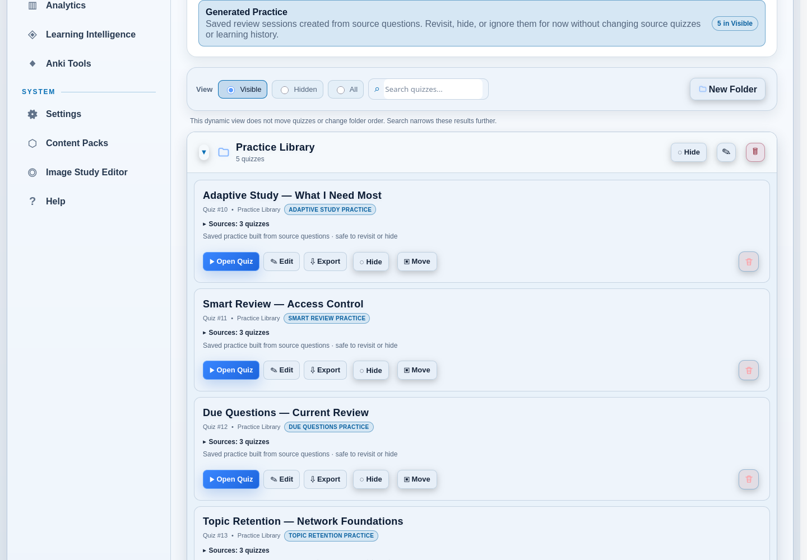
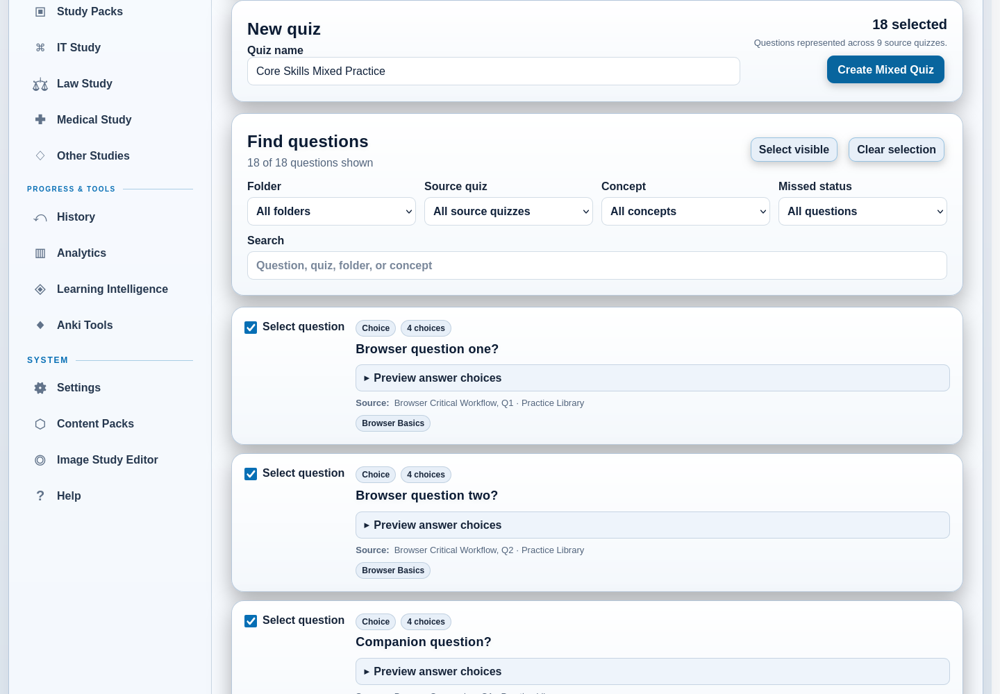
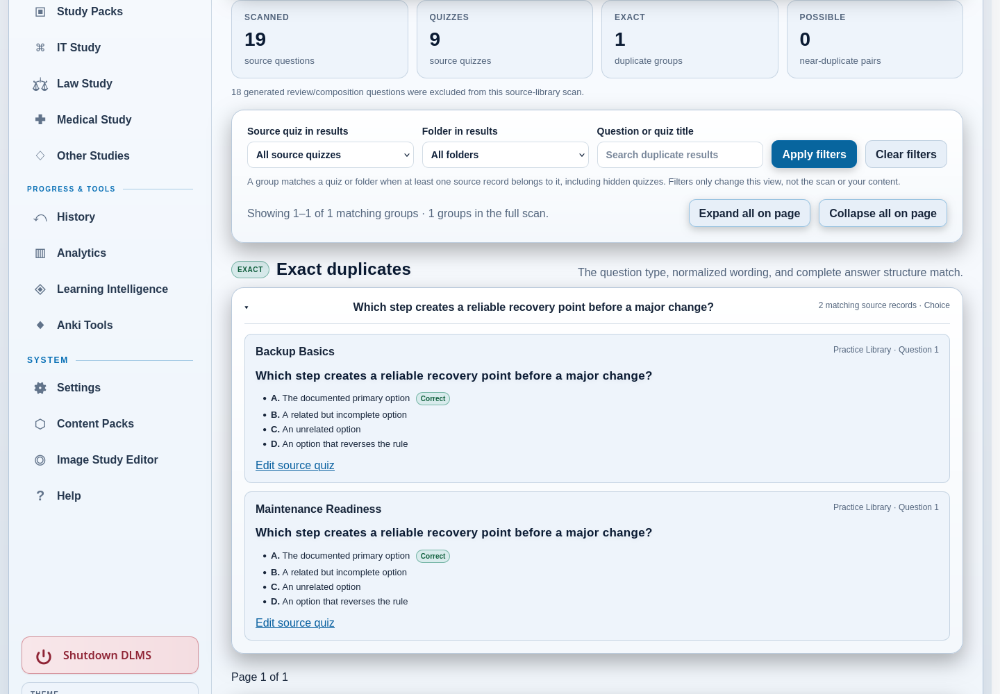

# 5. Quiz Library and Organization

The **Quiz Library** is the main home for saved quizzes. Use it to open a quiz,
find material by name, arrange persistent folders, focus the list with Smart
Views, and reach tools for mixing, comparing, or moving quiz content.

The Library does not replace History or Learning Intelligence. It organizes
the quizzes you can use; History records completed attempts, and Learning
Intelligence interprets saved learning evidence.

*The highlighted Smart View changes which quizzes are shown without moving
them from their folders.*

## Read the Library at a glance

The summary at the top reports visible and hidden quiz counts, folders in the
current view, and the number of items in that view. Each quiz card shows its
title, quiz number, folder, and relevant status badges. Its primary action is
**Open Quiz**; other actions let you edit, export, hide, move, reorder, or
delete it.

The **Visible**, **Hidden**, and **All** controls set the Library scope:

- **Visible** is the normal working collection. It omits individually hidden
  quizzes and hidden folders.
- **Hidden** shows individually hidden quizzes and everything inside hidden
  folders.
- **All** shows both visible and hidden material and labels hidden state.

The search field filters quiz cards by the searchable context shown in the
Library, including titles and folder information. Search can reveal a matching
quiz from a hidden folder while you are browsing the visible library; DLMS
marks that folder context. Clear the search to restore the normal scope.

An active Smart View and the search field work together: the Smart View chooses
the dynamic set, and search narrows it further. Choose **Show full library** to
leave the Smart View without changing folder placement or saved order.

## Organize quizzes with folders

Folders are persistent Library organization. Unlike Smart Views, they are
places you create and explicitly assign quizzes to.

### Create and use a folder

1. Choose **New Folder**.
2. Enter a folder name and choose **Save**.
3. On a quiz card, choose **Move**.
4. Select the destination and choose **Save**.

A custom folder remains available even when it has no quizzes in the current
view. It displays **No quizzes in this view** rather than disappearing. Hidden
folders remain available as Move destinations and are labeled **(hidden)**.

**Uncategorized** is the protected default location for a quiz with no other
folder. It stays out of the way when empty and cannot be hidden, renamed, or
deleted.

### Reorder and collapse Library sections

Drag a folder header to reorder visible folder sections. Dragging a quiz card
changes its order only within its current folder; it does not move the quiz to
another folder. Use **Move** for that. Keyboard users can use the labeled Up
and Down controls instead of dragging.

Select a folder header or its disclosure control to collapse or expand the
section. The down-pointing indicator means expanded; the right-pointing
indicator means collapsed.

### Hide a folder or quiz

Hiding is a visibility choice, not deletion.

- **Hide** on a quiz removes that quiz from normal Visible browsing.
- **Hide** on a custom folder removes the folder from Visible browsing without
  changing the individual hidden setting of each quiz inside it.
- **Hidden** shows every quiz inside a hidden folder, plus individually hidden
  quizzes from visible folders.
- **All** shows the full set and marks hidden folders and quizzes.

When you unhide a folder, quizzes that were also individually hidden remain
hidden. This lets folder visibility and quiz visibility remain separate.

Renaming a custom folder changes its Library label. Deleting a custom folder
does not delete its quizzes; DLMS moves them to Uncategorized and preserves
their individual hidden state. The confirmation shown before folder deletion
states this consequence.

## Use Smart Views as dynamic filters

**Smart Views** group quizzes from current metadata or learning state. They do
not create folders, move quizzes, or change folder order. A quiz can qualify
for more than one view, and membership can change as you add content, complete
attempts, or update review state.

| Smart View | What it includes |
| --- | --- |
| **Needs Review** | Quizzes containing source questions that are due or overdue in the Due Questions schedule. |
| **Recently Added** | Quizzes with a reliable creation or import time within the last 30 days. This means recently added, not recently studied. |
| **Low Score** | Quizzes whose latest completed attempt is below 75%. It is not a Mastery calculation. |
| **Unfinished** | Valid interrupted sessions saved in this browser. Another browser or device can correctly show a different set. |
| **OCR Imported** | Quizzes published through an explicit local OCR workflow. DLMS uses recorded provenance rather than guessing from the title. |
| **Generated Practice** | Saved Adaptive Study, Smart Review, Concept Review, Due Questions, and Topic Retention practice sessions. |

Each view keeps deterministic Library order and provides an empty state when
nothing in the current Visible, Hidden, or All scope qualifies. **Unfinished**
is different from the others because its count comes from the current
browser's recoverable checkpoints. The quiz-taking chapter explains that
browser-local boundary.

## Recognize Generated Practice

Several review workflows create playable quizzes from existing source
questions. Their Library cards carry a specific label such as **Adaptive Study
practice**, **Smart Review practice**, **Concept Review practice**, **Due
Questions practice**, or **Topic Retention practice**. The **Generated
Practice** Smart View gathers these saved sessions in one place, including
sessions that you have moved to custom folders.

In the full Library, generated practice that would otherwise appear under
Uncategorized is collected in an automatic **Generated Practice** group. This
is a view of the existing quiz placement, not a folder that DLMS saves or that
you need to manage. If you deliberately move a generated session to a custom
folder, it stays in that folder instead.

When question lineage is available, a generated-practice card identifies its
source quiz or reports the number of contributing source quizzes. Expand a
multiple-source summary to see their current names. A renamed source uses its
current name; old generated sessions or sessions whose source was deleted may
instead say that source details are unavailable. DLMS does not guess provenance
from similar question wording.

Generated practice does not replace or modify its source quiz. DLMS keeps the
relationship to the source questions so saved answers can contribute to the
appropriate learning record. Generated sessions are persistent Library items:
there is no automatic cleanup or archive process. You can revisit one, hide it
to reduce everyday clutter, or ignore it for now. Hiding it does not remove the
source quiz or learning history.

The later study-and-review chapter explains when to choose each generator. If
you simply want DLMS's current recommendation, start with **Today’s Review** on
the Dashboard rather than choosing among all of them in the Library.

## Keep Mixed Quizzes distinct

A **Mixed Quiz** is built from questions you deliberately select across
multiple source quizzes. It is labeled **Mixed Quiz** in the Library and is not
included in Generated Practice. That distinction reflects its purpose: a Mixed
Quiz is a reusable curated composition, not a transient recommendation created
by a review engine.

### Build a Mixed Quiz

Open **Mix Questions** under Library Tools. The builder lets you filter source
questions by folder, source quiz, concept, missed status, or text search. Each
candidate shows its type, source quiz and folder, concept labels, and a preview
of choices or matching pairs.

1. Enter a name for the new quiz.
2. Apply any filters that help locate the material.
3. Select at least two questions represented across at least two source
   quizzes. **Select visible** and **Clear selection** can help with the current
   filtered list.
4. Review the selected count, represented source quizzes, answer previews, and
   provenance.
5. Choose **Create Mixed Quiz**.

Equivalent source candidates are presented once rather than being silently
duplicated in the output. The builder notes when one underlying question is
represented by multiple source records. Creating the mix leaves every source
quiz unchanged and records source relationships for the new questions.

## Review possible duplicates

Choose **Find Duplicates** under Library Tools to scan ordinary source
questions. **Duplicate Question Review** separates:

- **Exact duplicates**, where compatible question type, normalized wording,
  and complete answer structure match; and
- **Possible duplicates for review**, where wording and answer structure are
  similar enough to justify a conservative comparison.

The report shows the source quiz, folder, question number, question text, and
answers or matching pairs. Generated review and composition copies are excluded
from this source-library scan so they do not create expected noise.

Use **Source quiz in results**, **Folder in results**, and the question/quiz-title
search together, then choose **Apply filters**. A group matches a quiz or folder
if at least one of its source records belongs to it; hidden quizzes are included.
**Clear filters** restores the full result view. The summary still describes the
complete scan, not just the filtered results.

Results are shown in pages of up to 20 groups, with exact and possible matches
kept separate. Large scans start with groups collapsed. Open a group's heading
to inspect its records, or use **Expand all on page** and **Collapse all on page**.
Use **Previous page** and **Next page** to move through the results. These controls
only change what you see; they do not change the duplicate findings or any quiz.

This tool is advisory only. It does not merge, rewrite, or delete anything, and
a possible match is not a claim that two questions are interchangeable. Use
**Edit source quiz** if you decide that a manual change is appropriate.

## Move quizzes between DLMS installations

**Quiz Bundles** under Library Tools opens the Portable Quiz Bundle workflow.
Use it to select one or more eligible ordinary quizzes for export, or to upload
and validate a bundle from another DLMS installation. An import is staged for
preview before publication, and title collisions are handled without silently
overwriting or merging existing quizzes.

Portable Quiz Bundles preserve supported quiz content, metadata, folder
information, and required media. They deliberately omit scores, attempts,
learning history, and review schedules. Generated review sessions and Mixed
Quizzes are not ordinary export candidates. Use a full DLMS backup—not a quiz
bundle—when you need to protect or transfer the complete personal workspace.

Detailed export, validation, and collision procedures appear in the import,
export, and portability chapter.

## Manage an individual quiz safely

Each quiz card provides actions appropriate to saved Library content:

- **Open Quiz** opens the mode chooser so you can begin Study Mode or Exam
  Mode.
- **Edit** opens the quiz editor for titles, timing, questions, choices,
  matching pairs, explanations, and concepts supported by that quiz.
- **Export** downloads an import-oriented text representation for compatible
  classic choice content.
- **Hide** or **Unhide** changes normal Library visibility without deleting the
  quiz.
- **Move** assigns the quiz to another folder.
- the Up and Down controls reorder it inside its current folder; and
- the delete control permanently deletes the quiz after confirmation.

Deletion is different from hiding. If your goal is only a less crowded
Library, hide the quiz or its folder. Before deleting important content, make a
backup or an appropriate export and read the confirmation carefully.

The Library also offers a human-readable TXT reference of the complete quiz
collection. That reference is not a restorable or importable full-library
package. Use an individual quiz export, Portable Quiz Bundle, or full backup
according to what you need to preserve.

## Keep a growing Library understandable

Use folders for stable subject or course organization and Smart Views for a
temporary question such as “What was added recently?” or “Which quizzes have
due material?” Search within the current scope when you know part of a title or
folder name.

Generated Practice labels and their Smart View keep machine-created review
sessions recognizable without treating them as source quizzes. Mixed Quiz
labels identify curated combinations worth keeping. If a dynamic view is empty,
return to the full Library rather than creating a folder to imitate it.
