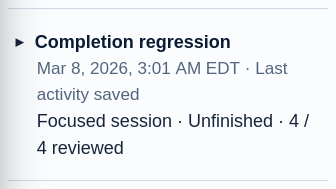
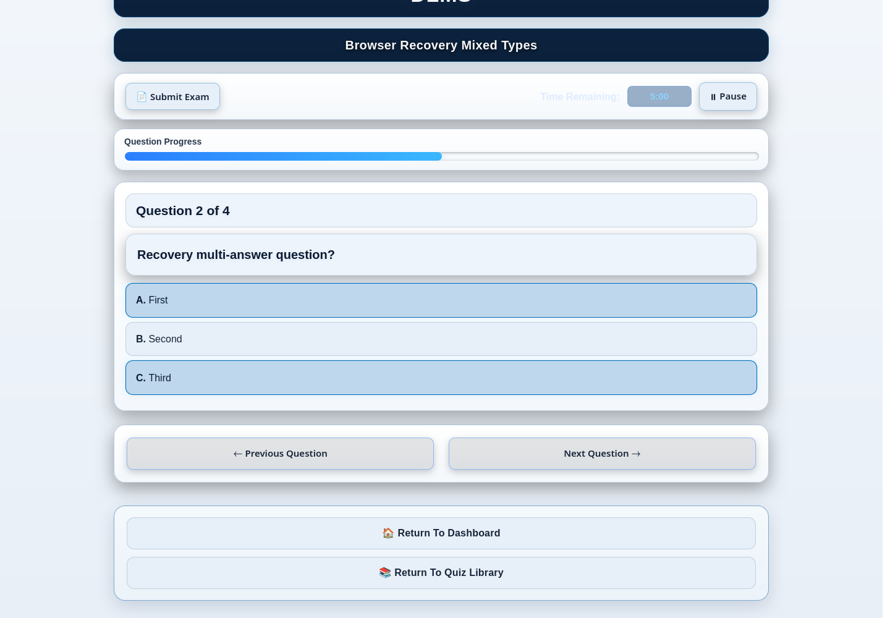
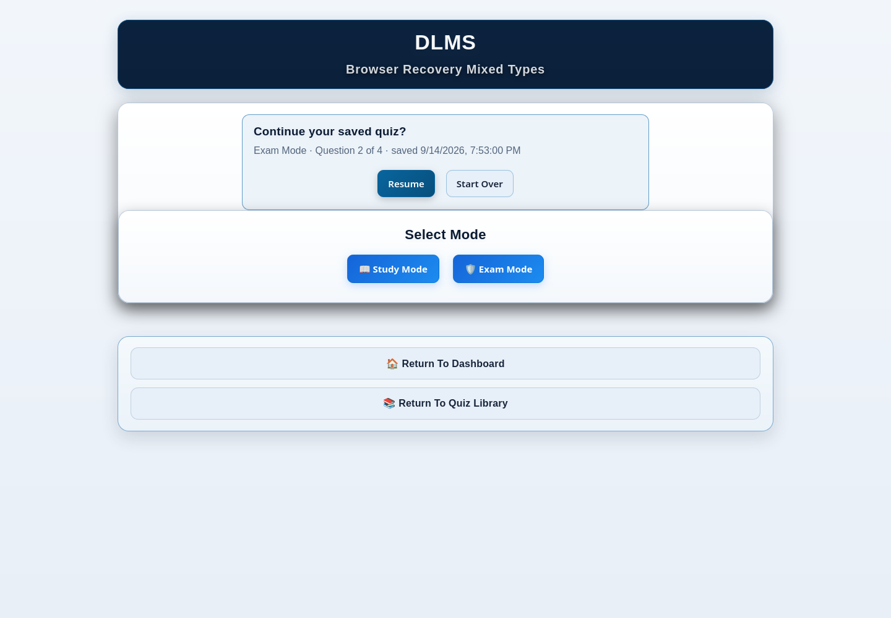

# 6. Taking Quizzes

DLMS uses the same quiz experience for ordinary Library quizzes and most
generated practice. When you open a quiz, choose the mode that matches your
goal:

- choose **Study Mode** to learn at your own pace with immediate feedback; or
- choose **Exam Mode** for a timed, test-like attempt with results after
  submission.

Both modes use the quiz's saved questions, but they record and present your
work differently.

## Open a quiz

You can launch a quiz from the Quiz Library, Dashboard, a Study Pack or bank,
or a review action. An ordinary Library card uses **Open Quiz**. The quiz first
shows its title and a **Select Mode** panel with Study Mode and Exam Mode.

After you choose a mode, the question area shows the current question number,
the total number of questions, and a progress bar. **Previous Question** and
**Next Question** move through the set. Previous is unavailable on the first
question, and Next is hidden on the final question. Return links remain
available for the Dashboard and Quiz Library.

If the current browser already has a valid interrupted checkpoint for that
quiz, DLMS presents recovery choices before you start a new session. See
[Resume an interrupted quiz](#resume-an-interrupted-quiz) below.

## Answer the supported question types

### Single-answer choice

Select the one answer you believe is correct. In Study Mode, selecting an
answer saves learning evidence and shows immediate feedback. You can choose
another answer to try again. In Exam Mode, the selection is retained without
showing whether it is correct before submission.

### Multi-select choice

Select every answer you believe is correct. Select an answer again to remove
it. The question behaves as multi-select because its author marked multiple
answers correct; there is no separate mode switch while taking it.

Study Mode tells you to keep going until you have selected the complete correct
set and identifies an incorrect selection without revealing an unchosen answer
as if you had selected it. Exam Mode records the selected set and grades the
complete set at submission.

### Matching

Matching questions pair each left-hand item with one answer from the answer
pool. The default **Drag & Drop** view supports several interaction methods:

- drag an answer chip into its target with a mouse;
- select an answer and then select its target on touch or with the keyboard;
  or
- choose **Dropdowns** to use a select-list interface.

Use the clear control beside a placed match when you want to change it. Both
interaction modes use the same answers and grading. Some matching quizzes show
only a configured subset of a larger bank or reverse the matching direction;
the instructions and presented labels define the current attempt.

### Images and hotspots

A choice or matching question can include a supporting image above its answer
controls. A **hotspot question** instead asks you to select a particular region
of the image. Point to the requested structure and activate the image. Keyboard
users can focus the image, position the crosshair with arrow keys (Shift gives a larger step), and submit that selected position with Enter or Space. Keyboard use does not supply a correct target or count as assistance.

In Study Mode, hotspot feedback reports whether the selected region is correct
and can show available explanation or source-verification detail. In Exam Mode,
the location is retained for final grading without immediate correctness.

## Use Study Mode for guided learning

A saved Study session keeps ordered responses, the first graded outcome, later
corrections and observable assistance separately. Select an answer, read feedback
and correct mistakes as needed. Correcting an answer does not erase the first miss.
Incomplete multiple-answer or matching selections are not automatically graded as
a wrong first answer. Feedback exposed before a later answer can mean independent
success is not established. DLMS does not assume an external AI answer was read.

Watch save notices: an answer is durable only after acknowledgement. **Retry**
resends the same pending response identity; it must not create duplicate credit.
Do not close a tab with failed saves or clear its browser recovery data. A known
expired security token can be renewed automatically once while preserving the
request. Other failures still need the displayed recovery action.

### Finish a full or focused review

1. Give a complete response for every question in this session.
2. Resolve any pending or failed saves.
3. Select **Finish Review** and wait for **Review completed**.

Complete wrong or assisted answers count as reviewed; correctness is not required
to finish. Coverage alone is not completion. A full review covers that regular
quiz's current question set; a generated focused session covers only its selected
set and cannot finish a whole source quiz. First outcomes and assistance remain
available in Study History after completion.

For example, if you answer a question wrong and then correct it, both responses
remain saved. You can leave and resume later. The original difficulty still helps
prioritize practice; merely returning tomorrow does not prove it is due. New
independent Study successes advance a spaced interval only when the **previous
interval has elapsed**, not with immediate retries or new sessions. The existing
schedule uses 1, 3, 7, 14 and 30 days; correcting a miss is not a new independent win.

*Reviewed, correct independently and finished are different facts.*

### Question Tools and marks

**Mark for review** saves an intention to revisit. Open **Marked questions** for
this quiz or all marked quizzes, select questions, and independently use **Start
focused quiz** or **Export to Anki**. Neither clears marks. Practice supports text
choice/matching; Anki supports text choice. Image/hotspot marks remain available
for direct review. Read included/excluded counts before acting; edited, missing
or Learning Scope-excluded sources are not silently substituted.

Use **Select all on this page** or **Deselect all** with the displayed scope.
Deselecting checkboxes does not remove saved marks; **Unmark selected questions**
is a separate confirmed action. Larger selections are not silently truncated.
See [Anki](14-anki-decks-and-printable-cards.md) and
[External AI](12-external-ai-workflows.md) for optional handoffs.

## Use Exam Mode for a test-like attempt

Exam Mode uses the quiz's configured timer. Older or otherwise unconfigured
quizzes fall back to the standard 90-minute duration. The remaining time is
shown in the quiz toolbar.

Answer questions and move backward or forward as needed. DLMS does not show
correctness, explanations, or Study Mode learning aids during the attempt. Use
**Pause** when you need to stop the countdown temporarily; the paused overlay
keeps the exam covered until you choose **Resume**.

Choose **Submit Exam** when you are finished. Manual submission asks for
confirmation. If time reaches zero, DLMS submits automatically. Unanswered or
incorrect items do not receive credit.

After scoring, DLMS saves one completed attempt before it treats the Exam Mode
checkpoint as finished. The results panel shows the score and percentage and
offers **Review This Attempt**, **View Full History**, **Retake Exam**, and
**Return to Dashboard**.

If the final attempt cannot be persisted, the result explicitly says it was
not saved and offers **Retry Saving Attempt**. The exact pending attempt remains
recoverable; DLMS does not clear it merely because a score appeared on screen.

## Resume an interrupted quiz

DLMS keeps bounded recovery checkpoints for interrupted Study Mode and Exam
Mode sessions in the current browser profile. Reopening that quiz can show
**Continue your saved quiz?** with the saved mode, question position, and time.

- **Resume** restores the valid checkpoint and continues the session.
- **Start Over** clears that browser's checkpoint and begins without the saved
  progress.
- **Finish Saving Submitted Attempt** can appear when an Exam Mode attempt was
  already submitted but its final save still needs confirmation.

The Dashboard and the Library's **Unfinished** Smart View can also surface a
Resume action marked **This browser**. That label is important: an interrupted
checkpoint belongs to the browser profile where it was created, not to every
device connected to the same DLMS server.

To clear a browser checkpoint without removing the quiz, open **Manage browser
resume point → Clear browser resume point** on its Dashboard card and read the
confirmation. Pending or failed saves retain recovery priority; do not discard
them. Clearing a checkpoint does not delete durable Study history or finish a review.

DLMS validates a checkpoint against the current playable quiz. A checkpoint
that has expired, is malformed, or no longer matches an edited quiz is not
silently applied to incompatible content.

Study Mode clears a completed checkpoint only after **Finish Review** is
acknowledged. Saving every response alone does not finish it. Exam Mode clears its checkpoint only after
the final attempt is successfully persisted. If you leave on an unanswered
final question or a save fails, recovery remains available.

### Durable resume and another browser

A supported current quiz can also resume acknowledged partial Study progress
from DLMS. This differs from a browser checkpoint, which can include unsaved
responses and an Exam in progress. Resolve the browser's pending saves first.
Competing Study tabs have ownership/takeover checks; a stale tab cannot overwrite
newer acknowledged work. Review the conflict message instead of starting over.
Changed questions can reject a stale page. Older unsupported self-contained quiz
pages explicitly require owner-controlled regeneration; they must not appear to
save the new tracking successfully. See [safe recovery](18-troubleshooting.md).

## Understand shared and browser-local state

This distinction matters most when two computers use the same DLMS LAN/server
installation.

| Shared from the DLMS host after refresh | Local to one browser profile |
| --- | --- |
| Completed Exam Mode attempts and History | Interrupted Study or Exam checkpoint |
| Successfully saved Study Mode learning activity | **This browser** Resume action |
| Due Questions counts and scheduling state | Current question position and unsaved recovery details |
| Learning Intelligence and other persisted recommendations | Recovery state from a different browser or device |

Two clients can therefore show different unfinished quizzes while correctly
showing the same server-derived due count after refresh. Completing a quiz on
one client updates successfully persisted learning state for the other client;
it does not copy or clear an unrelated interrupted checkpoint in that other
browser.

If you use several browser profiles on the same computer, treat them as
separate clients for recovery purposes.

## Review results and choose the next step

Exam Mode results lead directly to the saved attempt, while **History** lets you
find prior attempts by quiz and review missed-question details. Depending on
question type, Review can preserve your selected answer, the correct choice or
pairs, an explanation, or hotspot feedback.

Saved Study Mode answers and completed attempts also contribute to broader
progress and recommendation features. The next chapters explain how to use
Study next, missed-question review, Due Questions, Topic Retention
Schedule, and Learning Intelligence without confusing their different roles.
When you are simply deciding what to study now, return to the Dashboard and
start with **Study next**.

## If a quiz does not proceed normally

First check the question type: multi-select answers toggle on and off, matching
requires every presented target, and **Dropdowns** provides an alternative to
drag and drop. If DLMS reports an unsaved Study response or Exam attempt, keep
the page open and use the displayed **Retry** or **Finish Saving Submitted
Attempt** action. The recovery checkpoint remains until the save is safe.

For browser-specific Resume questions, stale-looking completed state, and
other symptoms, use the focused guidance in
[Troubleshooting](18-troubleshooting.md#quiz-resume-and-history-problems).
