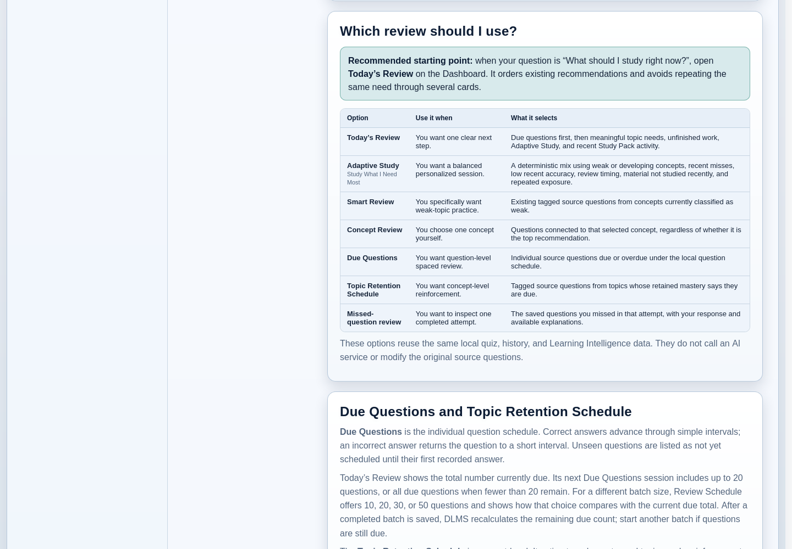
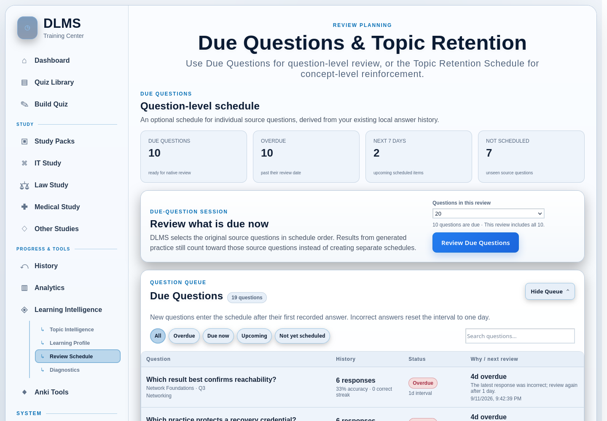

# 7. Study and Review

DLMS offers several ways to review material because different study needs call
for different kinds of selection. You can let DLMS suggest one useful next
action, ask it for a balanced personalized session, focus on a known weak
area, follow a schedule, or revisit the exact questions missed on an Exam.

If you are unsure which path to choose, start with **Today’s Review** on the
Dashboard. It is the default answer to “What should I study right now?” The
other options remain useful when you already know the kind of review you want.

## Choose the right review option

| Study option | Best for | Who chooses the focus? | Timing | Result |
| --- | --- | --- | --- | --- |
| **Today’s Review** | One clear place to begin | DLMS assembles a short plan from current signals | May include scheduled work | Links to the appropriate existing action |
| **Adaptive Study** | A balanced personalized session | DLMS balances several learning signals; you choose the size | On demand, with review timing among its signals | Generated Practice |
| **Smart Review** | Broad practice across weak concepts | DLMS selects currently weak concepts; you choose the size | On demand | Generated Practice |
| **Concept Review** | Focused practice on one concept | You choose the concept | On demand | Generated Practice |
| **Due Questions** | Question-level spaced review | DLMS selects due or overdue source questions; you choose the batch size | Scheduled per question | Generated Practice |
| **Topic Retention Schedule** | Concept-level reinforcement | You choose a review window of scheduled topics | Scheduled per concept | Generated Practice |
| **Missed-question review** | Understanding mistakes from one completed Exam | You choose the attempt | On demand | Review of that saved result |

These options reuse the same local quizzes and saved learning evidence. They do
not alter the source questions, and none of them requires an AI service.

## Start with Today’s Review

**Today’s Review** is a planning surface on the Dashboard, not a separate
review algorithm. It asks the existing scheduling and Learning Intelligence
features for their current signals, then presents a short list of actions with
a reason for each one. **Manage Learning Scope** beside the
plan lets you choose which folders inform those automatic recommendations;
saved **Resume** cards from this browser remain available even when their
folder is excluded.

Depending on your material and activity, the list can include:

- a **Due Questions** action for individual questions that are due or overdue;
- a focused action for a weak or developing concept;
- **Study What I Need Most** when broader Adaptive Study is more useful than a
  specific due or concept action;
- recent Study Pack activity that may be worth continuing; and
- a valid interrupted Study or Exam session from the current browser.

Specific due or concept work can take the place of a broader Adaptive Study
suggestion when both would describe the same need. This keeps the panel from
repeating essentially the same recommendation through several cards.

### Understand unfinished cards

An unfinished card is marked **This browser**. It comes from a recovery
checkpoint in the current browser profile and can differ from what another
computer sees when both use the same DLMS server. Successfully saved due
counts, completed activity, concepts, and other server-derived recommendations
are shared after refresh; interrupted checkpoints are not.

If you no longer want to continue, choose **Remove from Today’s Review** on
that card and confirm **Clear Saved Resume Point**. This clears only the
saved resume point in this browser, including its unfinished answers. The
quiz, completed history, scores, and activity already saved to DLMS remain.
Other browsers and other unfinished sessions are unaffected. If Study answers
or a submitted Exam attempt are still waiting to be saved, DLMS keeps the
checkpoint and asks you to **Resume Quiz** or **Finish Saving** first.

A genuinely interrupted generated session can replace the equivalent new
recommendation on that browser. Once the session is complete and its activity
has been saved, its recovery checkpoint is cleared. It should not return as a
stale Resume card or prevent DLMS from offering the next valid recommendation.

### Read a Due Questions card

Today’s Review distinguishes the **total number due** from the **next batch**.
For example, if 34 source questions are due, the card can report all 34 while
offering a next review of up to 20. The Dashboard’s default Due Questions batch
limit is 20, but the actual batch is smaller when fewer than 20 questions are
due.

After you complete and successfully save a limited batch, return to or refresh
the Dashboard. DLMS recalculates the schedule. If more source questions are
still due, it offers a new Due Questions action for the remaining work rather
than resurrecting the completed generated quiz. If none remain, neither a
stale Due action nor a stale Resume action should appear.

## Use Adaptive Study for a balanced focus

Open **Learning Intelligence** and choose **Study What I Need Most**, or follow
an Adaptive Study action from Today’s Review. Where a size control is offered,
choose 10, 20, 30, or 50 questions. A session can be smaller when fewer source
questions are eligible.

Adaptive Study is the broadest personalized review option. It can draw from
multiple quizzes and concepts, using the learning information that is actually
available. In practical terms, it favors material such as:

- weak or developing concepts;
- questions missed recently;
- concepts that are due, overdue, or approaching review;
- material with low recent performance;
- questions not reviewed recently or not studied yet.

DLMS also lowers the priority of repeatedly exposed material and spreads a
session across concepts and source quizzes where possible. These are
deterministic priorities, not predictions about you or claims of statistical
certainty.

Adaptive Study remains usable with little or no history. In that case, it
falls back to a stable, balanced mix of available source questions instead of
pretending to know your weaknesses. Questions without concepts can still
participate when other signals support them.

Use Adaptive Study when you want DLMS to balance several kinds of need. Use
Smart Review instead when you specifically want the current weak-concept set.

## Use Smart Review for weak areas

**Smart Review** is available from Learning Intelligence. Choose 10, 20, 30,
or 50 questions, then choose **Start Smart Review**. The resulting session can
be smaller when fewer source questions qualify.

Smart Review selects existing tagged source questions only from concepts that
currently meet DLMS’s weak-area rule. It spreads the available selection across
weak concepts and source material rather than creating new AI-generated
questions.

This makes Smart Review narrower than Adaptive Study: it does not try to
balance every available signal. It is broader than Concept Review because it
can cover several weak concepts in one session. If no concept has enough
evidence to be classified as weak, or no suitable tagged source questions are
available, DLMS explains that it cannot build the session yet.

## Use Concept Review for one chosen concept

In the Learning Intelligence concept table, choose **Study concept** beside the
concept you want to practice. A weak-concept card in Today’s Review can lead to
the same kind of focused action.

Concept Review gathers source questions carrying that concept across relevant
quizzes and creates a focused session of up to 20 available questions. You are
choosing the subject deliberately; it does not have to be DLMS’s highest
current recommendation.

The number of available questions depends on the concept metadata in your
library. A concept can have meaningful performance information but only a
small number of unique source questions, so a requested session does not imply
that 20 distinct questions always exist.

## Review Due Questions

**Due Questions** is DLMS’s optional question-level spaced schedule. Each
eligible source question receives its own schedule after its first recorded
answer. Before that first answer, the Review Schedule lists it as **Not yet
scheduled** rather than pretending that a due date exists.

The schedule uses a small, explainable sequence:

| Consecutive correct responses | Next interval |
| --- | --- |
| 1 | 1 day |
| 2 | 3 days |
| 3 | 7 days |
| 4 | 14 days |
| 5 or more | 30 days |

An incorrect response resets the next interval to one day. The Review Schedule
labels questions **Due now**, **Overdue**, **Upcoming**, or **Not yet scheduled**
and explains the latest result and next date.

Open **Learning Intelligence → Review Schedule** to see the full question
queue. Choose 10, 20, 30, or 50 under **Questions in this review**, then choose
**Review Due Questions**. DLMS includes all due questions when the due total is
smaller than your selected batch size; otherwise it takes the selected number
from the ordered due queue. The status beside the selector explains the total
and the size of the next batch.

The Question Queue is expanded by default. Use **Hide Queue** when you only
need the planning summaries; DLMS remembers that choice in the current
browser. When the queue is open, combine its text search with **All**,
**Overdue**, **Due now**, **Upcoming**, or **Not yet scheduled** to narrow the
rows. These controls only change what the table displays—they do not change
question schedules or the ordered queue used to build a review session.

Generated practice does not receive a second independent schedule. Answers to
a generated copy are credited to its original source question when that
relationship is known.

## Follow the Topic Retention Schedule

The **Topic Retention Schedule** appears on the same Review Schedule page, but
it is not another name for Due Questions.

- Due Questions schedules **individual source questions** from their own
  correct and incorrect response history.
- Topic Retention Schedule schedules **concepts** from concept Mastery,
  evidence, and time since the latest activity.

*The upper section schedules source questions; the lower section schedules
concept-level reinforcement.*

A concept needs at least three counted responses before it enters the topic
schedule. Current mastery bands use review intervals of about one day below 60,
three days from 60 through 74, seven days from 75 through 89, and 14 days at 90
or above. Once the scheduled date has passed, DLMS shows a separate retained-
mastery estimate. This estimate helps with timing; it does not rewrite your
answers, overall accuracy, or base Mastery.

To build topic-level practice:

1. Open **Learning Intelligence → Review Schedule**.
2. Under **Topic Retention Schedule**, choose **Due / overdue only**, **Due +
   next two days**, or **All scheduled topics**.
3. Choose a session size of 10, 20, 30, or 50 questions.
4. Choose **Start Topic Review**.

DLMS then reuses tagged source questions belonging to the concepts in that
review window. Choose this workflow when the topic timing matters more than the
schedule of each individual question.

## Review questions missed on one Exam

Open **History**, locate a completed Exam attempt, and choose **Review**. The
missed-question page shows the questions recorded as incorrect for that
specific attempt, together with your saved response and the expected answer or
matching/hotspot context where available.

This is a result-inspection workflow, not a new scheduled quiz. It answers
“What did I miss on that Exam?” Smart Review instead asks which concepts are
currently weak, and Due Questions asks which individual questions have reached
their next scheduled date.

The missed-question page can also let you select supported items for an Anki
package or prepare an explanation prompt for an external AI. Those optional
actions are covered in the later Anki chapter and in
[External AI Workflows](12-external-ai-workflows.md).

## Understand Generated Practice

Adaptive Study, Smart Review, Concept Review, Due Questions, and Topic
Retention sessions are published as playable quizzes. The Quiz Library labels
them as **Generated Practice** so you can distinguish them from ordinary
source quizzes. Their questions retain links to the original source material,
so their answers can strengthen the same learning record.

In Study Mode, answer the review questions, then select **Finish Review** on
the final question. Answering the final question alone leaves the session
available to resume. Finish Review waits for saved answers and confirms the
whole session before closing its browser resume point.

After Finish Review succeeds, its Library card shows **Completed** and a date.
Uncategorized sessions move from the active **Generated Practice** group to the
collapsed **Completed Generated Practice**
group. The **Generated Practice** Smart View still finds both, and a session
moved to a custom folder stays there. Completed reviews remain playable and
saved; DLMS does not automatically delete them. Learning evidence, History,
Analytics, and schedules remain intact. An unfinished retake may still show a
browser-local Resume card, independent of its completed Library status.

A **Mixed Quiz** is different. Although DLMS builds it from questions in other
quizzes, it is a deliberate, named composition intended for reuse and is not
grouped as transient Generated Practice. See
[Quiz Library and Organization](05-quiz-library-and-organization.md) for the
Library distinction.

## Put the choice into practice

Use the comparison at the beginning of this chapter whenever the options feel
similar. Start with Today’s Review when you want one recommendation; move to a
specialized option only when its focus matches your immediate goal. Generated
review quizzes use the normal Study and Exam experience described in
[Taking Quizzes](06-taking-quizzes.md).
