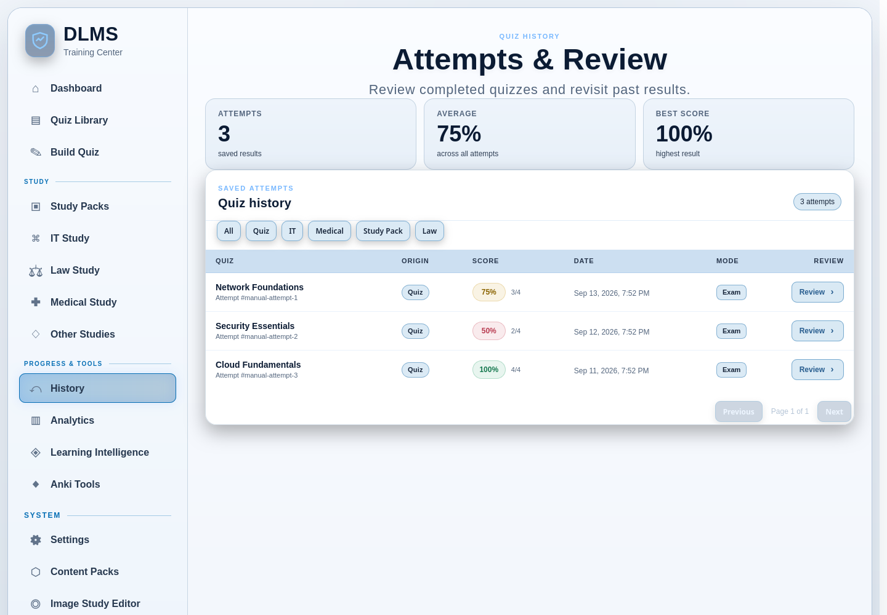

# 9. History, Results, and Progress

DLMS records a completed **Exam Mode** submission as an **attempt** after the
result has been successfully saved. **History** lets you find those attempts,
compare their scores, and inspect the questions missed on a particular Exam.
**Analytics** summarizes the same saved attempts by quiz.

Study Mode records a different kind of progress. Its successfully saved answers
can contribute to Learning Intelligence and review schedules, but they do not
create a completed attempt row in History. This distinction lets Study Mode
remain an ongoing learning activity while Exam Mode produces a durable,
test-like result.

## What is saved after a quiz

### After Study Mode

Each completed Study Mode response is saved as learning evidence when DLMS
acknowledges it. That evidence can update question schedules, concept metrics,
the Learning Profile, and later recommendations. Repeated interactions with one
question in the same Study session are handled conservatively so they do not
inflate concept evidence.

Finishing Study Mode does not create a scored History attempt. You can see its
effect in the learning and review views instead. If a response save fails, use
the visible **Retry** action; unsaved activity cannot contribute to those shared
views yet.

### After Exam Mode

When you submit an Exam—or its timer reaches zero—DLMS grades the complete set
and calculates a score and percentage. It then saves the attempt, its response
details, and the missed-question snapshots. Only after that save succeeds does
DLMS clear the completed Exam recovery checkpoint.

The results panel confirms that the attempt was saved and offers:

- **Review This Attempt** to open its missed-question details;
- **View Full History** to browse saved attempts;
- **Retake Exam** to start the quiz again; and
- **Return to Dashboard** to choose another action.

If scoring succeeds but persistence does not, DLMS says that the attempt was
not saved and offers **Retry Saving Attempt**. Until the retry succeeds, it does
not appear as a normal durable History record. The browser retains the pending
attempt so a visible score is not mistaken for a successfully recorded result.

## Browse History

Open **History** from the primary navigation. Summary cards show the total
number of saved attempts, their average score, and the best score in the
current origin view.

The attempt table shows:

- quiz title and attempt number;
- origin, such as Quiz, IT, Medical, Study Pack, or Law;
- score as a percentage and correct count out of the total;
- completion date and time;
- recorded mode; and
- a **Review** action.

Use the origin buttons to show all attempts or narrow the list to one supported
source area. These filters do not delete or alter anything. If the result set
spans several pages, use **Previous** and **Next**; the summary continues to
describe the selected origin, not just the rows on the current page.

The Dashboard’s recent activity list also links to recently saved attempts. If
you arrive at History with one attempt selected, DLMS highlights and scrolls to
that row when it is available on the loaded page.

## Review one completed attempt

Choose **Review** in History or **Review This Attempt** on the Exam results
panel. The review page begins with the quiz title, score, correct count, date,
mode, and attempt number. It then shows the questions that were recorded as
missed in that attempt.

For each miss, DLMS preserves enough saved context to explain the result:

- choice questions show the expected answer and your selected answer;
- matching questions show the expected pairs and the pairings you submitted;
  and
- hotspot questions show the study image, expected region, selected point,
  and available explanation or source context.

If the attempt contains no misses, the page says so rather than creating an
empty review list. The review page does not reconstruct every correctly
answered question; its purpose is missed-question follow-up for that saved
attempt.

Supported text questions can be selected for an `.apkg` Anki export or for an
external-AI explanation prompt. Hotspot review remains visual and is not forced
into text-only Anki or AI controls. The later Anki chapter and
[External AI Workflows](12-external-ai-workflows.md) explain those optional
actions.

## Understand missed-question review

A **missed-question review** is tied to one completed Exam attempt. It answers:
“Which questions did I miss this time, and what did I select?” The content is a
saved snapshot, so you can inspect the result even if your later study activity
changes the broader recommendation picture.

This differs from the other review options:

- **Smart Review** selects current source questions from concepts now
  classified as weak.
- **Due Questions** selects individual source questions whose scheduled dates
  have arrived.
- **Adaptive Study** balances several current signals across the library.
- **Concept Review** uses the one concept you choose.

Those generated review systems create playable practice. The History review
page instead explains the misses from a particular result. See
[Study and Review](07-study-and-review.md) for the complete comparison.

## Use Analytics to compare Exam results

Open **Analytics** from the navigation when you want aggregate Exam-attempt
patterns rather than one attempt’s details. The top of the page summarizes:

- total saved attempts;
- the number of quizzes with recorded attempts;
- average score; and
- best score.

The **Quiz Performance** table groups attempts by quiz and shows attempt count,
average, best, pass rate, latest score/date, and a simple recent direction. In
this view, a result of 75% or higher counts toward pass rate. The direction
compares the latest attempt with the immediately preceding attempt for that
quiz: higher is Improving, lower is Down, and equal is Steady. With only one
attempt, it shows Not enough data.

Choose **Review** beside a quiz to open its latest saved attempt. Analytics is
informational; viewing or filtering it does not modify the attempts.

### Do not confuse the two kinds of trend

The simple Analytics direction is about the latest two Exam scores for one
quiz. **Learning Intelligence Trend** is about response windows for one concept
and requires more evidence. A quiz-level arrow and a concept-level Trend can
therefore differ legitimately.

Similarly, one Exam percentage does not equal concept Mastery. Mastery can use
Study and Exam evidence across quizzes, considers evidence and recency, and may
cover only questions carrying that concept. See
[Learning Intelligence](08-learning-intelligence.md) for those indicators.

## How completed activity affects later study

Successfully saved activity becomes input to other DLMS views:

- Exam answers and saved Study responses can update concept accuracy, recent
  accuracy, Mastery, and Trend.
- Correct and incorrect responses can advance or reset a source question’s Due
  Questions schedule.
- Misses, concept status, and recency can affect Adaptive Study selection.
- Topic evidence and elapsed time can affect the Topic Retention Schedule.
- Today’s Review can change after refresh because the underlying due and
  learning state has changed.

Generated practice remains connected to its source material. Completing an
Adaptive, Smart, Concept, Due Questions, or Topic Retention quiz can therefore
improve the same source-question and concept evidence rather than producing an
unrelated second learning record.

These updates depend on successful persistence. A calculated but unsaved Exam
and a failed Study-response save do not safely become shared learning evidence
until their retry succeeds.

## Shared history and local recovery

If several browser devices use the same DLMS LAN/server installation, completed
and successfully saved activity belongs to the server’s data. After refresh,
the clients can see the same History attempts, learning evidence, due counts,
and server-derived recommendations.

An unfinished quiz checkpoint is different. It remains in the browser profile
where the interruption occurred and is marked **This browser** in Today’s
Review. Another device can see a completed attempt without receiving the first
device’s Resume card. Completing work on one device also does not erase an
unrelated unfinished checkpoint in another browser.

This is expected behavior for a local-first, single-user application; it is not
account-based device synchronization.

## Interpret scores with context

An Exam score describes the answers in one completed attempt. Average, best,
pass rate, and the latest-versus-previous direction help compare attempts, but
they do not prove long-term retention by themselves.

When a score is lower than expected, use the missed-question review to inspect
the actual mistakes. Then use Learning Intelligence if you want to see whether
the same concepts show a broader pattern across Study and Exam activity. When
you simply want DLMS to recommend the next action, return to Today’s Review.

## Common questions

### Why is a Study session not listed in History?

History lists saved Exam attempts. Study Mode saves question-level learning
evidence for feedback, scheduling, and Learning Intelligence instead of
creating a scored attempt row.

### Why did Learning Intelligence change after I finished a quiz?

The newly saved answers became part of the concept and question history. They
can affect overall and recent accuracy, Mastery, Trend, schedules, and later
recommendations. A single new response may not change every indicator because
the views use different evidence requirements.

### Why can I see a result but not find it in History?

Check whether the Exam result said that saving failed. A score can be
calculated in the browser before the durable attempt is acknowledged. Use
**Retry Saving Attempt** or **Finish Saving Submitted Attempt** when offered;
the result reaches History only after the save succeeds.

Questions about why Resume appears only in one browser are covered under
[Shared history and local recovery](#shared-history-and-local-recovery). The
distinction between missed-question review and other review choices is covered
under [Understand missed-question review](#understand-missed-question-review).
