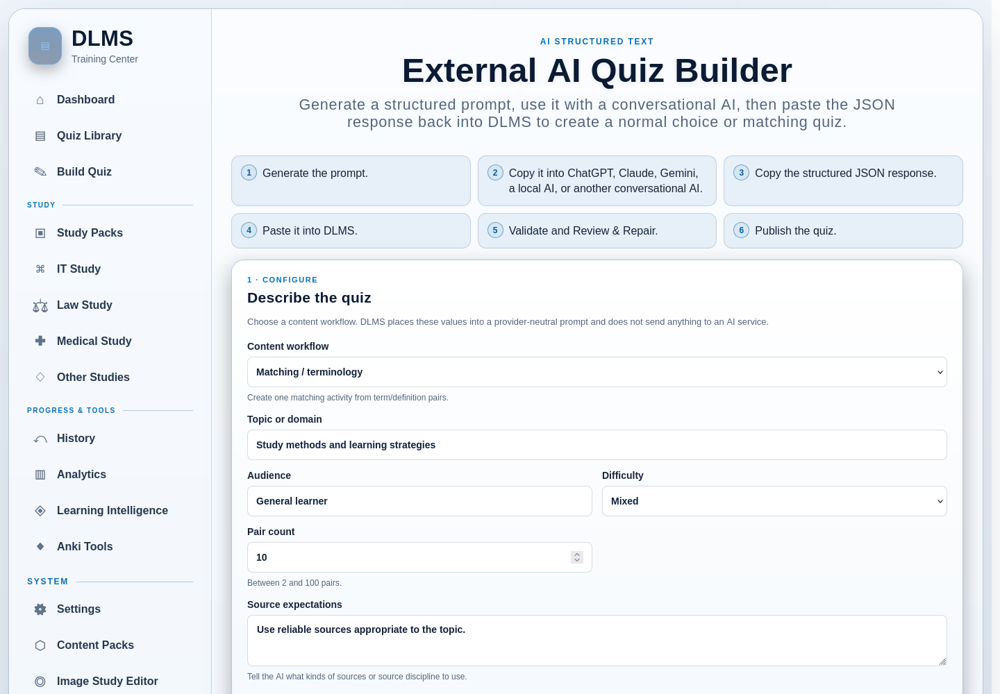
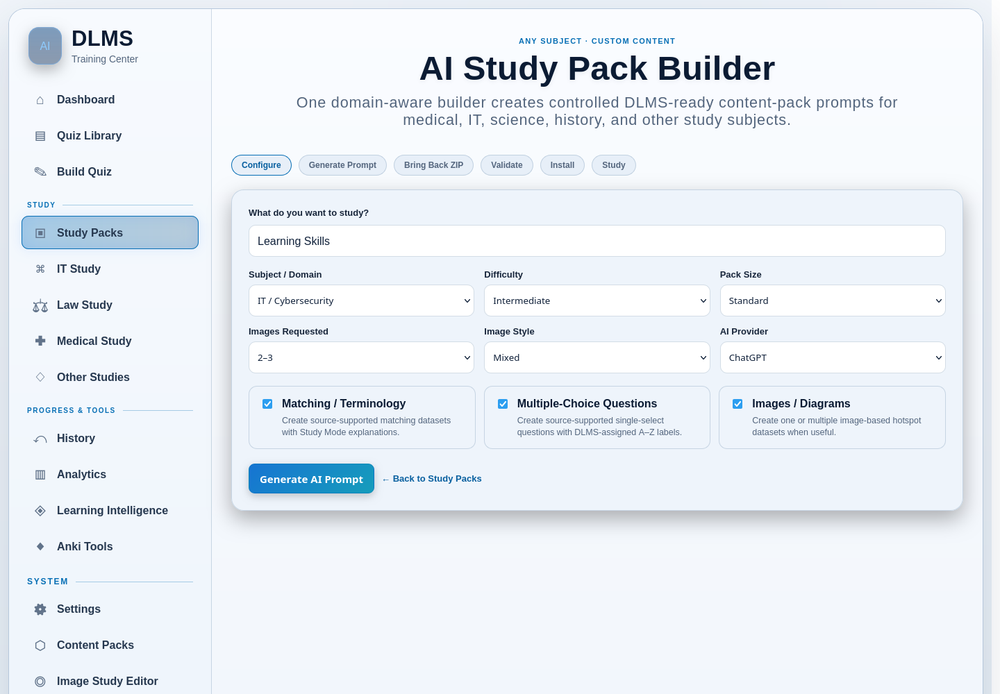

# 12. External AI Workflows

DLMS can prepare study-content prompts for use with an external conversational
AI. These workflows are optional and provider-neutral: DLMS does not call an AI
provider API, send your content automatically, or retrieve an answer for you.
You decide what to copy out of DLMS and what to bring back.

The external provider may be ChatGPT, Claude, Gemini, a locally hosted tool, or
another conversational AI that can follow the requested format. DLMS itself
does not require an AI account or subscription, although the provider you choose
may have its own access rules and privacy terms.

## Choose the right External AI workflow

| Workflow | You give the AI | You bring back | DLMS result |
| --- | --- | --- | --- |
| **External AI Quiz Builder — Choice questions** | A structured quiz prompt | JSON text | A normal choice quiz after validation and Review & Repair |
| **External AI Quiz Builder — Matching / terminology** | A structured matching prompt | JSON text | A normal matching quiz after validation and Review & Repair |
| **AI Study Pack Builder** | A pack request and format contract | A downloadable Study Pack ZIP | A validated Content Pack installed for use under Study Packs |
| **AI explanation helper** | A prompt about one or more questions | Nothing is imported automatically | An external conversation for additional explanation |
| **Law Case Review prompt/import** | A requested case-study packet outline | Structured case-packet text | A saved import and, after preview, a Case Review |

The first two choices share the **External AI Quiz Builder**. The Study Pack
path is a separate ZIP/archive workflow. Explanation and Law Study helpers also
use manual copy/paste handoff, but they do not publish through the quiz builder.

## Protect your material and verify the result

Copying a prompt to another service moves that prompt outside DLMS's local data
boundary. Before doing so, remove private, licensed, confidential, or identifying
material that you should not share, and consider the provider's terms and data
practices.

AI output can contain factual errors, unsupported answers, invented citations,
bad pairings, malformed structure, or unsafe fields. DLMS validates structure
and prevents unsupported content from being published blindly, but validation
cannot prove educational accuracy. Compare important material with trustworthy
sources and use Review & Repair deliberately.

## Build choice questions from structured text

Use this path when you want a conversational AI to propose a normal single- or
multiple-answer choice quiz.

1. Open **Build Quiz → External AI Quiz Builder**.
2. Set **Content workflow** to **Choice questions**.
3. Enter the topic or domain, audience, difficulty, question count, and source
   expectations. You can request from 1 to 100 questions.
4. Optionally expand **Requested source metadata** and enter an organization,
   dataset, version, public source URL, or license that the response should
   preserve.
5. Choose **Generate Prompt**, then **Copy Prompt**.
6. Open the conversational AI of your choice and paste the complete prompt.
7. Copy its JSON response and paste it into **AI Response** in DLMS.
8. Choose **Validate & Review**.

The generated prompt asks for 2–26 distinct choices per question, a genuine
single- or multiple-answer mode, explicit correct-answer flags, an explanation,
concepts, and source fields. DLMS assigns the visible A–Z labels; the AI should
not embed those labels in the choice text.

The response paste is limited to 1 MiB. DLMS accepts bare JSON or one fenced JSON
block. The pasted text is treated as data and is never executed.

## Review choice-question output

Valid or repairable structured content opens **Review & Repair**. The response
remains a temporary draft until you publish it.

For every included question:

- verify and edit the question text;
- inspect the single-answer or multiple-answer mode;
- edit, add, delete, or reorder choices;
- mark the complete set of correct choices;
- verify the explanation and concepts; and
- explicitly confirm correctness.

You can also correct the quiz title and source metadata or exclude an unusable
question. Changing a confirmed question resets confirmation so that the edited
result cannot be published without another check.

DLMS revalidates the entire submitted review. Invalid answer counts, incomplete
choices, unsafe source URLs, excessive field sizes, or other blocking problems
must be repaired or excluded. If publication fails, the latest reviewed draft
is preserved so you can correct the problem rather than losing the work.

Choose **Publish Reviewed Quiz** only when the content is ready. The result is a
normal quiz in the Quiz Library. **Start Over** discards the temporary draft;
successful publication removes it as well. Abandoned drafts expire.

## Build matching and terminology content

Use this path when the desired result is one matching activity made from
term/definition pairs.

1. Open **External AI Quiz Builder** and choose **Matching / terminology**.
2. Enter the topic, audience, difficulty, source expectations, and a pair count
   from 2 to 100.
3. Generate and copy the prompt, use it in the external AI, and paste the JSON
   response back into DLMS.
4. Choose **Validate & Review**.

The requested structure contains one matching question, a direction, the pairs
shown per attempt, term/definition values, optional per-pair categories and
explanations, question-level concepts and explanation, and source metadata.

In Review & Repair, edit, add, remove, and reorder pairs; correct direction and
round size; and confirm every final relationship. A missing side, repeated term,
repeated definition, conflicting mapping, unsupported field, invalid type, or
out-of-range count blocks publication until repaired. DLMS validates your edited
version again on the server.

The published result uses the same normal matching format described in
[Matching, Terminology, and Image-Based Content](11-matching-terminology-and-image-based-content.md).

## Create an AI-assisted Study Pack

Use the **AI Study Pack Builder** when you want a richer reusable package that
can include matching datasets, choice-question sets, and image/hotspot material.
Do not use this path when a normal quiz is sufficient.

1. Open **Study Packs → Create Study Pack** or an available subject-area AI
   builder link.
2. Enter the topic and choose a subject/domain, difficulty, pack size, desired
   image count and style, provider, and content types.
3. Choose **Generate AI Prompt**. Review the prompt, then use **Copy Prompt** or
   **Copy Prompt & Open AI** when that provider action is available.
4. Ask the external AI to follow the complete pack contract and return a
   downloadable DLMS Study Pack ZIP.
5. Back in the Builder, choose the ZIP under **Bring Back Study Pack ZIP** and
   select **Validate Study Pack ZIP**.
6. Read the validation review. Correct the archive and upload it again if it has
   blocking errors. If it has warnings only, inspect them and explicitly confirm
   installation when appropriate.
7. Install the pack, then open Study Packs and choose the activity you want to
   generate. Installation itself does not immediately create a quiz.

*This workflow requests a complete Study Pack ZIP rather than the JSON text
used by the External AI Quiz Builder.*

This workflow requires an actual ZIP with the expected manifest, data, and any
required assets. Plain pasted prose or JSON from the quiz builder is not an
installable Study Pack. Conversely, do not paste an archive into the structured
text quiz builder.

Medical Study Pack requests add stricter source, licensing, provenance, and
image guidance. These instructions help the provider produce a reviewable
package; they are not a guarantee that the generated content is medically
accurate or suitable for clinical decisions.

The Study Packs and Content Packs chapter explains how installed material is
managed and used after validation.

## Ask for an external explanation

For supported choice questions in Study Mode, **Question Tools** offers two ways
to use the same AI-ready prompt. **Review with AI** copies it and opens the
configured provider, where you can paste it for an explanation.
**Copy Question** puts the prompt on your clipboard and leaves you on the quiz
page; paste it into any AI conversation you already have open. Copy Question is a
local clipboard action: clicking it does not send anything to an AI provider or
require a particular provider.

Depending on the current rendered question state, the prompt can include the
question, answer choices, your current answer or available correctness context,
and visible explanation text. When no correct answer is exposed, it may say
**Correct answer not visible**. It does not add the quiz title or mode label,
and question images are not embedded. These two Question Tools are not offered
for matching or hotspot questions and are hidden in Exam Mode.

With the AI Helper enabled under **Settings → AI Integration**, missed-question
review can prepare a prompt for one item or a combined prompt for selected
supported missed questions. Its automatic copying can be turned off in Settings.

This is a one-way learning aid. DLMS does not automatically retrieve, validate,
or save the provider's explanation, and the external response does not replace
the quiz's saved correct answer. If no provider URL is configured, copy the
prompt and open your chosen tool yourself.

## Create a Law Case Review with External AI

Law Study has a specialized prompt-and-import workflow for a case packet. Enter
the case and course, select the requested sections—such as a case brief,
Socratic review, IRAC drill, or rule flashcards—and generate the prompt. Copy it
to the provider, then return to **Import Case Packet** and paste the complete
text.

**Save & Preview Case Packet** preserves the raw import and shows the recognized
sections. After checking the preview, create the saved Case Review. The Case
Review can provide editable IRAC work, Socratic responses with revealable
guidance, rule material, notes, and Law Anki export where those sections were
included.

These are activities inside a saved Case Review. The separate **Future Study
Modes** cards on the Law Study landing page are non-interactive previews, not
standalone IRAC, Socratic, native flashcard, or Case Compare tools.

The Study Packs, Content Packs, and subject spaces chapter covers the complete
Law Study workflow.

## Troubleshoot External AI workflows

### DLMS says the response is not valid JSON

For the quiz builder, paste only the complete JSON object or one fenced JSON
block. Make sure you copied the entire response. If the AI returned prose,
multiple code blocks, a different schema, or truncated content, ask it to follow
the original prompt exactly and try again.

### The response opens with repair errors

This is expected when the structure is recoverable but incomplete. Repair only
content you can verify, exclude an unsafe item, and confirm the final answer set
or matching pairs. A structural warning is not evidence that the educational
content is correct.

### The provider did not return a usable ZIP

The AI Study Pack workflow cannot install plain text or an incomplete archive.
Return to the generated pack prompt and ask the provider to supply the required
downloadable ZIP. If the provider cannot create files, use the structured-text
quiz workflow for a normal quiz or build/import the content by another supported
method.

### Copying or opening the provider did not work

Browser clipboard permission or popup blocking can prevent the convenience
action. Select and copy the prompt manually, then open the configured provider
in another tab. For a Local / Custom provider, verify its absolute HTTP or HTTPS
URL in Settings.
