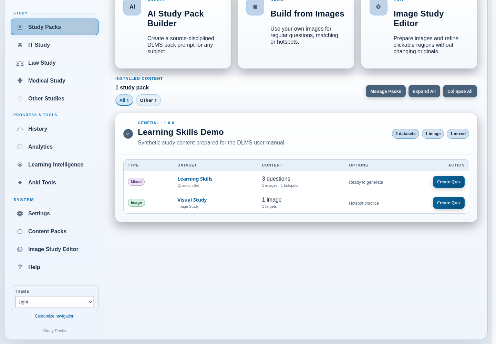
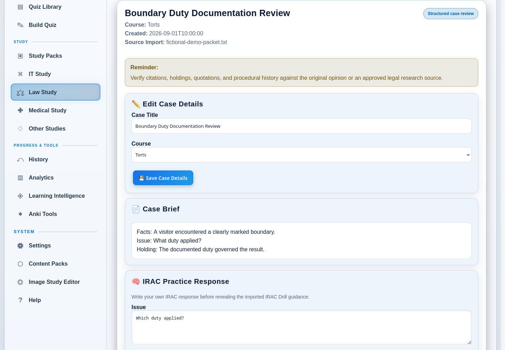

# 13. Study Packs and Content Packs

Study Packs let you keep a reusable source collection in DLMS and generate
focused quizzes from it when you are ready to study. A pack may contain
term/definition datasets, image and hotspot material, or prepared question
sets. The source collection stays installed while each generated quiz becomes
a separate playable item.

DLMS presents the same installed material through two different workspaces:

| Workspace | Use it for |
| --- | --- |
| **Study Packs** | Browse installed material, choose a dataset, set study options, and create a quiz. |
| **Content Packs** | Import, validate, inspect, export, or remove the package that supplies that material. |

In other words, use **Study Packs** to study and **Content Packs** to manage
pack files. A Study Pack is not a Quiz Library folder, a Portable Quiz Bundle,
or a full DLMS backup.

## Choose how to obtain a Study Pack

You do not need to use every pack-creation path.

| If you have… | Start with… |
| --- | --- |
| An installed pack whose material you want to practice | **Study Packs** |
| A compatible Study Pack ZIP from another source | **Content Packs** |
| A topic you want an external conversational AI to develop into a reusable package | **Study Packs → AI Study Pack Builder** |
| Your own diagrams, photographs, or other study images | **Study Packs → Build from Images** |

The AI-assisted ZIP exchange is documented in
[External AI Workflows](12-external-ai-workflows.md#create-an-ai-assisted-study-pack).
Creating a pack from your own images is documented in
[Matching, Terminology, and Image-Based Content](11-matching-terminology-and-image-based-content.md#create-image-based-study-material).

## Use an installed Study Pack

Open **Study Packs** from the sidebar. The catalog shows only installed packs
that contain usable learner-facing material. Expand a pack to see its datasets,
descriptions, content counts, and available options.

The catalog can contain three broad activity types:

- **Matching** datasets contain paired values such as terms and definitions.
- **Image** datasets contain images with named hotspot targets.
- **Mixed** datasets contain prepared question sets, which may combine choice,
  matching, image-supported, or hotspot questions when the pack provides them.

Use the **All**, **IT**, **Medical**, and **Other** filters when those categories
are available. These filters change what is shown; they do not move or modify a
pack. **Expand All** and **Collapse All** affect the packs currently visible.
The expanded/collapsed state is remembered in the current browser, so another
browser connected to the same DLMS server can present the catalog differently
without having different installed content.

### Create matching practice

For a matching dataset:

1. Expand the pack and locate the dataset.
2. Set **Pairs** to the number you want in the round. DLMS requires at least two
   and cannot include more pairs than the dataset contains. The interface uses
   10 by default when at least 10 pairs are available; smaller datasets use all
   available pairs.
3. Choose **Random**, **Term → Definition**, or **Definition → Term**.
4. Choose **Create Quiz**.

DLMS creates a matching-practice quiz and opens it. The full dataset remains in
the Study Pack, so you can generate another round later with different options.

### Create image or mixed practice

For an image dataset, choose **Create Quiz** to make hotspot practice from the
usable targets in that dataset. For a mixed question set, choose **Create Quiz**
to publish the prepared questions as a playable quiz. These activities do not
alter the installed source pack.

Generated pack quizzes appear in the Quiz Library and can record normal study
or exam results. DLMS also retains their source-pack relationship so completed
activity can contribute to learning history without rewriting the pack. The
generated quiz remains in the library until you choose to manage it; DLMS does
not automatically remove it after an attempt.

If recent Study Pack activity is useful to the daily plan, it may also appear
in **Today’s Review**. See
[Study and Review](07-study-and-review.md#start-with-todays-review) for the daily planning
workflow.

## Import a Content Pack ZIP

Use **Content Packs** when you receive a compatible DLMS Study Pack ZIP outside
the guided AI Builder.

1. Open **Content Packs**.
2. Under **Install Content Pack**, select the **Study Pack ZIP**.
3. Choose **Validate ZIP**.
4. Read the validation report. Blocking problems must be corrected in the
   source archive before it can be installed. Warnings deserve review but do
   not necessarily make a pack unusable.
5. If the report is valid and you trust the content, select the installation
   confirmation and choose **Install Study Pack**.
6. Open **Study Packs** to generate a learner-facing activity.

The upload may be at most 256 MiB. A pack archive must use the supported DLMS
structure, including one top-level pack folder and its manifest and dataset
files. DLMS checks the archive before installation rather than trusting its
filename or contents.

Installation does not silently replace an existing pack. If the same pack
identity or destination folder is already installed, DLMS leaves the installed
copy unchanged. Remove the old pack deliberately only when you understand the
effect, then validate the replacement as a new installation.

### Understand the validation report

The report summarizes the pack, datasets, expanded size, passed checks,
warnings, and blocking errors. Depending on the material, validation checks
may cover:

- archive paths and expected files;
- manifest and dataset structure;
- matching-pair uniqueness and completeness;
- choice-question answers and field types;
- image files and referenced assets;
- hotspot regions, concepts, sources, and license information; and
- limits intended to keep a local import bounded and safe.

Validation establishes that the package is structurally acceptable. It does
not prove that the subject matter is correct. Review educational claims,
citations, image rights, and AI-generated material against sources you trust.

If installation fails, DLMS reports that the pack was not installed and keeps
existing installed content unchanged. **Cancel & Remove Staging Files** discards
the temporary validation session without installing the pack.

## Manage installed Content Packs

The **Pack Manager** shows each installed package's status, domain and version,
dataset counts, storage use, and the number of tracked quizzes generated from
it.

- **Details** opens the manifest summary and a fresh validation report.
- **Export** downloads a valid pack as a Study Pack ZIP. Use this when you want
  to preserve or transfer the reusable package itself.
- **Open** returns to the Study Packs catalog.
- **Delete** removes an unprotected installed source pack after confirmation.

Invalid installed packs cannot be exported until their validation problems are
corrected. A pack that declares itself protected cannot be deleted from this
screen.

Deleting an unprotected pack removes its source datasets and pack assets, but
it does not delete quizzes that were already generated from the pack or erase
their attempt history. DLMS preserves image references needed by existing
legacy quizzes when required. Even with those safeguards, export a valid pack
or make a full backup before removal if you may need the source collection
again.

## Understand subject study spaces

Installed pack material can also appear in subject-oriented views. These are
convenient views over the relevant installed content, not separate copies.

- **IT Study** gathers matching, image, and question datasets from installed IT
  and cybersecurity packs.
- **Medical Study** gathers terminology and anatomy/image datasets from
  installed medical-domain packs.
- **Other Studies** filters Study Packs to subjects outside the dedicated IT,
  Law, and Medical spaces.

Subject links can be hidden or restored through navigation settings. Hiding a
link does not delete its content; you can still reach installed material from
Study Packs or Content Packs.

## Use Law Study

**Law Study** is a specialized subject workspace, but it is not a Content Pack
catalog. It organizes structured **Case Reviews** and their saved source
imports.

A normal Law Study flow is:

1. choose **Create Case Review** to prepare a provider-neutral case-packet
   prompt, or choose **Import Case Packet** when you already have the text;
2. save and preview the raw packet;
3. create a Case Review from the recognized sections; and
4. use its case brief, editable IRAC response, Socratic questions and saved
   answers, revealable guidance, rule material, notes, text export, or Law Anki
   export as available.

**Saved Imports** retains the raw packet separately from the resulting Case
Review. Deleting one does not silently delete the other. The complete external
handoff is covered in
[External AI Workflows](12-external-ai-workflows.md#create-a-law-case-review-with-external-ai),
and Law deck export is covered in
[Anki, Decks, and Printable Cards](14-anki-decks-and-printable-cards.md#export-law-study-cards).

The **Future Study Modes** cards on the Law Study landing page are previews,
not buttons for available standalone tools. Saved Case Reviews already contain
embedded IRAC and Socratic work and may contain rule material, but DLMS does
not currently provide separate standalone IRAC, Socratic, or native flashcard
modes. **Case Compare** is not implemented.

## Troubleshoot packs

### No Study Packs appear

No usable package may be installed, or the current subject filter may exclude
it. Choose **All**, open **Content Packs** to inspect installed status, or create
or import a supported pack.

### A dataset is missing from the catalog

DLMS skips a dataset it cannot load safely. Open the pack's **Details** report
in Content Packs. Correct the source package and reinstall it rather than
editing the installed files casually.

### A ZIP is rejected

Make sure it is a DLMS Study Pack ZIP, not a Portable Quiz Bundle, backup, Anki
deck, or ordinary ZIP of unrelated files. Correct any reported structure or
content problems in the source package and validate it again.

### A generated quiz remains after pack deletion

This is expected. The generated quiz and its history are separate from the
installed source pack. You can manage that quiz from the Quiz Library without
affecting the deleted pack.
