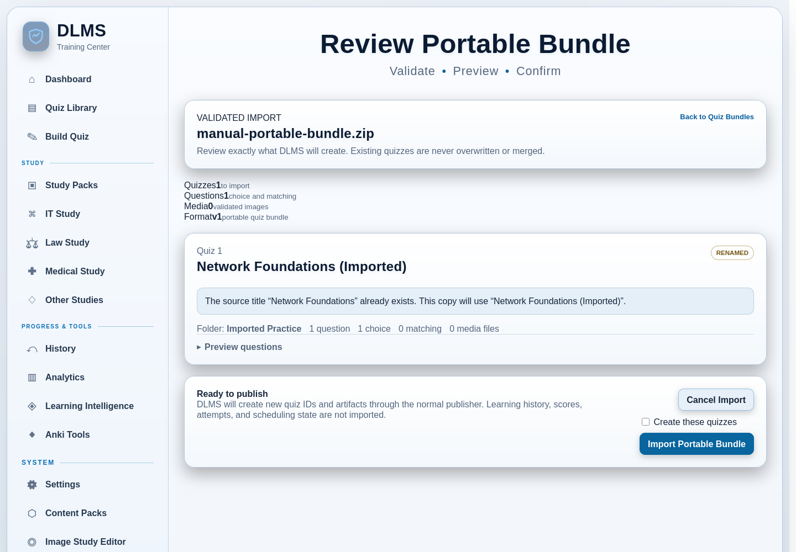

# 15. Import, Export, and Portability

DLMS uses several file formats because moving a quiz, recovering an entire
installation, installing reusable source material, and studying in Anki are
different jobs. Choose the narrowest format that preserves what you need.

## Choose the right format

| Goal | Use | Carries personal learning history? | Intended destination |
| --- | --- | --- | --- |
| Move one or more ordinary quizzes with supported rich content and media | **Portable Quiz Bundle** (`.zip`) | No | Another compatible DLMS installation |
| Recover or move your complete persistent DLMS state | **Portable Backup** (`.zip`) | Yes | A compatible DLMS installation you control |
| Transfer a reusable matching/image/question dataset package | **Study Pack ZIP** | No personal attempts or scores | Content Packs in DLMS |
| Edit or reimport one classic choice quiz as text | **Individual quiz export** (`.txt`) | No | DLMS text upload/paste workflow |
| Keep a readable snapshot of the complete Quiz Library | **Quiz Library Reference** (`.txt`) | No | A person; it is not importable |
| Study selected cards in Anki | **Anki package** (`.apkg`) | Only card text/status chosen for the deck | The external Anki application |
| Print selected front/back cards | **Printable card layout** | Only the selected card text | A printer or PDF-print destination |
| Exchange structured content with an external AI | Structured JSON text or a requested Study Pack ZIP | No automatic history transfer | The matching DLMS AI workflow |
| Preserve one Law Case Review as readable text | **Export Case Review** (`.txt`) | Includes that review's saved study content | A person or external document store |

These formats are not interchangeable. Renaming one ZIP, text file, or Anki
package to look like another format does not convert it.

## Move quizzes with a Portable Quiz Bundle

A **Portable Quiz Bundle** is the normal way to move a curated collection of
ordinary quizzes between DLMS installations. It is versioned, validated, and
can contain one or several quizzes.

The bundle preserves supported quiz content such as:

- quiz titles and folder placement;
- choice questions and correct-answer sets;
- matching questions and their pairs;
- explanations, concepts, source details, and relevant quiz/question metadata;
- Exam Mode timing and a supported quiz logo; and
- supported images needed by the exported quizzes.

It deliberately excludes attempts, scores, missed-question history, learning
events, scheduling state, adaptive/review state, and other
personal study data. Generated review/practice quizzes and Mixed Quizzes are
not offered for portable export; use their ordinary source quizzes when you
want transferable content.

### Export a bundle

1. Open **Quiz Library**.
2. Under the library tools, open **Quiz Bundles**.
3. Under **Export quizzes**, select one or more eligible source quizzes. Use
   **Select all** or **Clear** when helpful.
4. Review the live selected count and choose **Download Portable Bundle**.
5. Store or transfer the resulting `DLMS-Quiz-Bundle-...zip` file without
   changing its contents.

Export does not edit, move, or delete the source quizzes. If DLMS reports that
generated review or composition quizzes were excluded, that is an intentional
portability boundary rather than lost source content.

### Import a bundle

1. On the receiving installation, open **Quiz Library → Quiz Bundles**.
2. Under **Import a bundle**, select the Portable Quiz Bundle ZIP. The upload
   limit is 128 MiB.
3. Choose **Validate and Preview**.
4. Review the summary, each quiz title, folder, question-type counts, media
   count, and optional question preview.
5. Look for **RENAMED** notices. If a title already exists, DLMS proposes a
   predictable name such as `(Imported)` rather than overwriting or merging
   the existing quiz.
6. Select **Create these quizzes**, then choose **Import Portable Bundle**.

The imported quizzes appear in the indicated Quiz Library folders and behave
as independent ordinary quizzes in the receiving installation. DLMS can retain
their portable source details without making them depend on the source
computer.

DLMS rejects a malformed, unsafe, unsupported, excessive, or unexpectedly
structured archive before publication. Validation includes archive-path,
manifest, count/size, media, and reference checks. If a confirmed multi-quiz
import fails during publication, DLMS removes any quizzes completed by that
failed import rather than silently keeping a partial bundle. Existing quizzes
remain unchanged.

**Cancel Import** removes the staged copy and publishes nothing.

## Understand backups versus bundles

A Portable Quiz Bundle is not a full backup.

Use **Settings → Backup & Restore** when you need a recovery point or want to
move the persistent state of one DLMS installation. The backup includes quizzes
and playable data, the database and History, settings, Study/Content Packs,
quiz assets, PDF & Image Import banks and drafts, Law Study content, backgrounds,
and persistent logos.

Temporary uploads, pack-staging files, temporary logo previews, database
sidecar files, and older backup archives are deliberately excluded. A backup
therefore represents durable application state, not every temporary work file.

Restoring is a broader and more consequential action than importing quizzes.
DLMS validates the archive, shows a confirmation page, and creates a safety
backup of the current state before replacing it. The full procedure and restore
warnings are in
[Maintenance, Backup, and Data Management](17-maintenance-backup-and-data-management.md#restore-a-backup).

Use this practical rule:

- choose a **Portable Quiz Bundle** to share or transfer selected quizzes
  without the learner's history;
- choose **Portable Backup** to recover or migrate the learner's whole DLMS
  environment.

Because a backup can contain personal learning history and locally stored
content, protect it as personal data. Keep an independent backup outside the
DLMS data directory before a significant upgrade or destructive maintenance
operation.

## Transfer Study Packs

A **Study Pack ZIP** preserves a reusable package of matching datasets,
question sets, images, hotspots, concepts, and source information supported by
the pack format. It is installed through **Content Packs** and studied through
**Study Packs**.

To export an installed pack, open **Content Packs**, choose **Details** or the
row's **Export** action, and download the valid Study Pack ZIP. Invalid packs
cannot be exported until their structural errors are corrected.

On the receiving installation, validate and explicitly confirm the pack before
installation. The same pack identity is not silently replaced. For complete
pack management and deletion behavior, see
[Study Packs and Content Packs](13-study-packs-and-content-packs.md).

A Study Pack ZIP is not a Portable Quiz Bundle:

- the pack carries reusable source datasets from which activities can be
  generated;
- the quiz bundle carries selected already-published ordinary quizzes; and
- neither carries personal attempt history.

The **AI Study Pack Builder** also returns a Study Pack ZIP, but that archive
enters the same validation and installation boundary. See
[External AI Workflows](12-external-ai-workflows.md#create-an-ai-assisted-study-pack).

## Use quiz text files

### Export one classic choice quiz

Each Quiz Library card has an **Export** action that downloads an import-friendly
DLMS text file. This format records question text, A–Z choices, and the marked
correct answer or answers. It is useful for inspecting or editing a classic
choice quiz in a text editor and bringing it back through DLMS's normal text
upload or paste parser.

It is not the rich portability format. It does not preserve interactive
matching pairs, hotspot behavior, images, concepts, explanations, lineage, or
all other metadata in the way a Portable Quiz Bundle does. Use Quiz Bundles
when those features matter.

After editing an exported text quiz, import it as a new quiz through **Build
Quiz → Upload Quiz File** or the paste workflow described in
[Creating and Importing Content](04-creating-and-importing-content.md#import-structured-choice-question-text).
Review the parse preview before publication. The title, quiz ID, and folder
headers are useful reference information, but a text import creates according
to the current import workflow rather than restoring the old quiz object and
history.

### Download the full library reference

**Download Quiz Library Reference (TXT)** creates one human-readable file with
all quizzes, folders, questions, choices, and answer labels that the reference
can represent. It explicitly is not a restorable or importable library package.

Use it for reading, searching, auditing, or keeping a simple reference. Use a
Portable Quiz Bundle for selected quiz transfer or a full backup for recovery.

The paste-import preview may also offer `cleaned_quiz_text.txt`. That file is a
working copy after selected text-cleanup rules, not a backup or full-fidelity
export.

## Export Law Case Reviews

From a saved Case Review, **Export Case Review** downloads a readable text file.
It can include available case sections, sources, Socratic questions and answer
key, saved student Socratic responses, the IRAC drill and saved student IRAC
response, rule cards, and student notes.

This is a readable record, not a general Law Study import package or full DLMS
backup. Keep the original saved import and a DLMS backup when you need to
preserve the complete in-application workflow.

## Export cards for outside study

An `.apkg` deck carries selected text front/back cards into Anki. The printable
layout prepares the same kinds of selected cards for physical printing. Neither
format carries the source quizzes, interactive question behavior, or full DLMS
history.

See [Anki, Decks, and Printable Cards](14-anki-decks-and-printable-cards.md) for
quiz, missed-question, custom, Study Mode, Law, and printable workflows. Legacy
TSV endpoints remain only for compatibility and are not a normal guided export
path.

## Understand External AI exchange files

The External AI Quiz Builder exchanges structured JSON text manually. That
text is untrusted input and passes through validation and Review & Repair before
publication. The AI Study Pack workflow instead expects a downloadable Study
Pack ZIP.

Neither is a general-purpose export of personal DLMS state, and DLMS does not
send or receive the material through a provider API. Use
[External AI Workflows](12-external-ai-workflows.md) for the exact handoff and
privacy boundary.

## Portability and privacy

All of these exports are created locally, but the destination determines what
happens next. Copying a file to removable storage, email, a network share, an
AI provider, Anki synchronization, or another service moves that file outside
DLMS's local boundary.

Before transferring anything:

- confirm that you have permission to share its questions, images, sources,
  and other material;
- treat backups as personal data because they can include history and settings;
- review generated filenames and preview content for identifying information;
- keep an unchanged source copy until the receiving workflow succeeds; and
- import only files from sources you trust, even though DLMS validates their
  structure.

## Troubleshoot imports and exports

### A ZIP is rejected by the wrong screen

Use **Quiz Bundles** for a Portable Quiz Bundle, **Content Packs** for a Study
Pack ZIP, and **Backup & Restore** for a DLMS backup. Each screen rejects other
archive formats deliberately.

### An imported quiz was renamed

The receiving library already contained that title. DLMS created a new,
collision-safe title instead of overwriting or merging the existing quiz. Both
remain available.

### A generated or Mixed Quiz cannot be selected for a bundle

Portable Quiz Bundles intentionally offer ordinary source quizzes. Generated
practice and Mixed Quizzes retain relationships to other source material and
are excluded from this transfer workflow. Export the appropriate ordinary
source quizzes instead.

### A text export lost rich behavior after reimport

The classic text format represents question text, choices, and correct-answer
labels—not the complete rich quiz model. Use a Portable Quiz Bundle for choice
and matching content, concepts, supported media, and other preserved metadata.

### An export did not include History

Quiz text, Portable Quiz Bundles, Study Pack ZIPs, Anki packages, printable
cards, and Law text exports are content-focused formats. Use a full **Portable
Backup** when you need completed attempts, scores, and the broader persistent
DLMS state.
