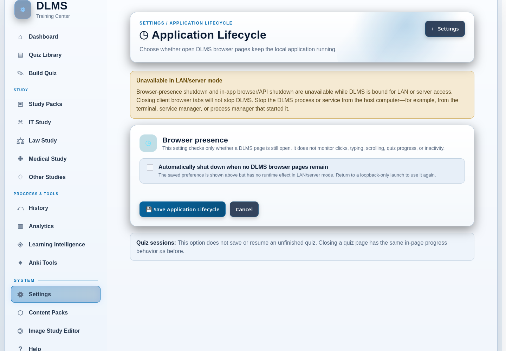

# 16. Settings and Runtime

DLMS settings let you adapt the interface and a few optional workflows without
changing your quizzes or completed study activity. Open **Settings** from the
main navigation, then choose a category. Each category saves independently, so
saving an Appearance change does not silently replace your Parsing or External
AI preferences.

This chapter also explains the difference between normal local desktop use and
LAN/server use. That distinction affects who can reach DLMS and how the
application can be stopped.

## Choose a settings area

| Settings area | Use it to |
| --- | --- |
| **Appearance** | Choose a theme, change the Dashboard title, or use a background image. |
| **Navigation** | Show or hide optional subject-area links in the sidebar. |
| **AI Integration** | Configure optional External AI helper buttons, provider destinations, and prompt templates. |
| **Parsing** | Control optional confidence and text-cleanup tools used during quiz preparation. |
| **Application Lifecycle** | Allow an eligible local DLMS process to stop after all DLMS browser pages close. |
| **Backup & Restore** | Create a portable recovery snapshot or stage a validated restore. |
| **Reset & Remove** | Clear or reset a deliberately selected part of DLMS, or permanently remove its data. |
| **System Tools** | Run occasional page repair or open the advanced Image Study Editor. |

The last three areas can affect substantial amounts of data. Read
[Maintenance, Backup, and Data Management](17-maintenance-backup-and-data-management.md)
before using them.

## Change the appearance

Open **Settings → Appearance** to change presentation without changing study
content. DLMS provides four themes:

- Light;
- Dark;
- Purple & Gold; and
- Maroon & Gold.

The theme applies throughout DLMS. It changes colors and surfaces, not grades,
question behavior, or learning data. **Purple & Gold** is the default on a new
installation.

You can also change the title shown on the Dashboard. The title cannot be
blank. A custom background is optional; leaving the file chooser empty keeps
the current background. For a readable result, use a landscape JPG or PNG at
least 1600×900 pixels and preferably smaller than 3–4 MB.

Choose **Save Appearance** to apply all changes on that page. Other connected
browsers use the saved host settings when their pages refresh.

## Simplify the navigation

Open **Settings → Navigation** to show or hide these optional study areas:

- IT Study;
- Law Study;
- Medical Study; and
- Other Studies.

Hiding an area removes its link from the navigation. It does not delete or
disable the area's content, History, analytics, or direct page address. **Study
Packs** and **Settings** remain available, and showing an area again restores
its link.

This is useful when you want a less crowded sidebar. It is not a content-removal
tool.

## Configure optional External AI helpers

**Settings → AI Integration** controls how DLMS prepares and hands off selected
prompts to an external conversational AI. These settings do not add an AI
provider inside DLMS and do not store provider credentials.

The page lets you:

- show or hide AI explanation buttons while reviewing missed questions;
- automatically copy a prepared explanation prompt before opening a provider;
- choose ChatGPT, Claude, Gemini, or a Local / Custom URL destination;
- edit the missed-question explanation prompt;
- edit the general Study Pack prompt and its Medical safety addendum; and
- edit the Law Study prompt.

A custom destination must be a complete `http://` or `https://` address for an
external AI service. DLMS rejects an address that points back to its own local
pages. Choosing a provider merely controls the external destination that DLMS
opens; you still decide what material to paste or upload there.

The prompt-template reset buttons restore text in the form. Choose **Save AI
Settings** to keep those restored defaults. Keep each displayed placeholder in
a customized template if you still want DLMS to insert that information.

For the actual copy/paste and archive workflows, see
[External AI Workflows](12-external-ai-workflows.md).

## Configure text parsing tools

**Settings → Parsing** controls optional pasted-text preparation tools. Saving
these settings affects future previews; it does not rewrite published quizzes
or change Learning Intelligence. For a complete example, see
[Create from pasted text](04-creating-and-importing-content.md#create-from-pasted-text).

| Setting | Default | What it controls |
| --- | --- | --- |
| **Enable Confidence Analysis on Preview** | On | Shows structural-format checks for question blocks, choice labels and explicit answer markers. This is not factual accuracy, answer correctness, learner mastery or Learning Intelligence. |
| **Enable Regex Replace Engine** | Off | Shows and enables **manual** `REGEX => REPLACEMENT` rules in pasted-text cleanup. It does not gate built-in presets or literal line removal. |
| **Enable Invisible Character & BOM Cleanup** | Off | Removes BOM, zero-width space, zero-width non-joiner, zero-width joiner and word-joiner characters during paste preview; also reduces excessive blank lines. It is not a general Unicode repair tool. |
| **Enable “Show Invisible Characters” Debug Tool** | On | Makes the preview's Show / Hide Invisible Characters tool available. Visualization reveals selected hidden characters, spaces and newlines; it does not change the source. |

These are the defaults when no saved preference overrides them. The core parser
also strips a **leading BOM** independently of the broader automatic-cleanup
setting. Text-file import uses that parser directly and bypasses paste-preview
cleanup.

The paste form offers three distinct kinds of cleanup:

- **Remove Unwanted Lines:** case-insensitive literal matching; removes the whole
  line containing the entered text.
- **Built-in presets:** number-prefix removal, PDF / Microsoft wrapping, and
  header/footer removal. Each runs independently, even with manual regex off.
  Leave presets unchecked when unnecessary. Keep meaningful question numbering:
  removing it can merge questions.
- **Manual regex replacement:** advanced pattern-based changes, available only
  when the Regex Replace Engine is enabled. Inspect the cleaned source carefully.

Preview is a source-transformation check, not the final parsed question
collection. **Yes, Build My Quiz** proceeds to parsing and publication; verify
the resulting question count and answer keys afterward.

## Understand how DLMS is running

The browser is DLMS's interface, but the DLMS application process runs on the
host computer. Opening or closing one browser page is therefore not the same as
starting or stopping the application.

### Local desktop mode

Normal DLMS use is loopback-only, usually at
`http://127.0.0.1:9001/`. Only the host computer can reach that address. A
packaged launch normally opens the default browser after DLMS is ready, though
automatic browser opening can be disabled or unavailable in a headless
session. If DLMS is running but no page opened, you can enter the local address
yourself.

Use **Shutdown DLMS** when you want to stop a local desktop instance
immediately.

### LAN/server mode

LAN/server mode is an explicit launch mode that binds DLMS to a non-loopback
network address. Other devices on the same reachable network can then open the
host computer's DLMS address and work with the same single-user server data.

DLMS does not provide account authentication or TLS for this mode. Use it only
on a trusted, appropriately firewalled local network. Do not expose the DLMS
port directly to the public Internet.

In LAN/server mode:

- in-app and browser/API shutdown are unavailable;
- automatic browser-presence shutdown is unavailable;
- closing client browser windows does not stop DLMS; and
- the process or service must be stopped from the host computer—for example,
  from the terminal, service manager, or process manager that started it.

The runtime mode comes from how the host starts and binds DLMS, not from the
network address of an individual browser. A browser on the host computer does
not turn a LAN/server launch back into local desktop mode.

## Use browser-presence shutdown in local mode

**Settings → Application Lifecycle** provides an optional convenience for
eligible local desktop use. When enabled, open DLMS pages report that they are
present. After the last DLMS page closes, the local process may stop after a
grace period of about five minutes. Reopening a DLMS page during that grace
period cancels the pending automatic shutdown.

The feature checks whether any DLMS page remains open. It does not measure
typing, clicking, scrolling, inactivity, or quiz progress. It also does not
save an unfinished quiz; quiz recovery follows the browser-local behavior
described in [Taking Quizzes](06-taking-quizzes.md#resume-an-interrupted-quiz).

The control is disabled in LAN/server mode. A saved preference may still be
shown there, but it has no effect until DLMS is launched in eligible
loopback-only mode again.

## Know what is shared between browsers

Saved Settings are part of the DLMS data on the host. Another client connected
to the same LAN/server instance sees those settings after loading or refreshing
the relevant pages. A tab that is already open may need a refresh before a new
title, theme, or navigation choice appears.

Interrupted quiz checkpoints are different: a **This browser** Resume item
belongs to that browser profile. Two clients can therefore share the same
saved settings, Quiz Library, History, and completed learning activity while
showing different unfinished sessions. See
[History, Results, and Progress](09-history-results-and-progress.md#shared-history-and-local-recovery)
for the practical distinction.

## Return settings to their defaults

**Reset Application Settings** is under **Settings → Reset & Remove**, not on
the ordinary settings forms. It resets the complete saved portal configuration,
including appearance, navigation visibility, parsing options, External AI
settings, the browser-presence preference, and Quiz Library folder
configuration. It also removes the custom background.

It preserves quizzes, questions, completed History, Study Packs, Content Packs,
PDF & Image Import banks, Law Study content, and backup archives. Folder values
already assigned to quizzes remain with those quizzes, but empty custom-folder
definitions and hidden-folder settings are reset. DLMS creates a safety backup
before performing this reset.

Because its scope is broader than one settings page, use the narrow category
form when you only want to change one preference. The reset procedure and
other data-removal choices are covered in
[Maintenance, Backup, and Data Management](17-maintenance-backup-and-data-management.md#reset-application-settings).
