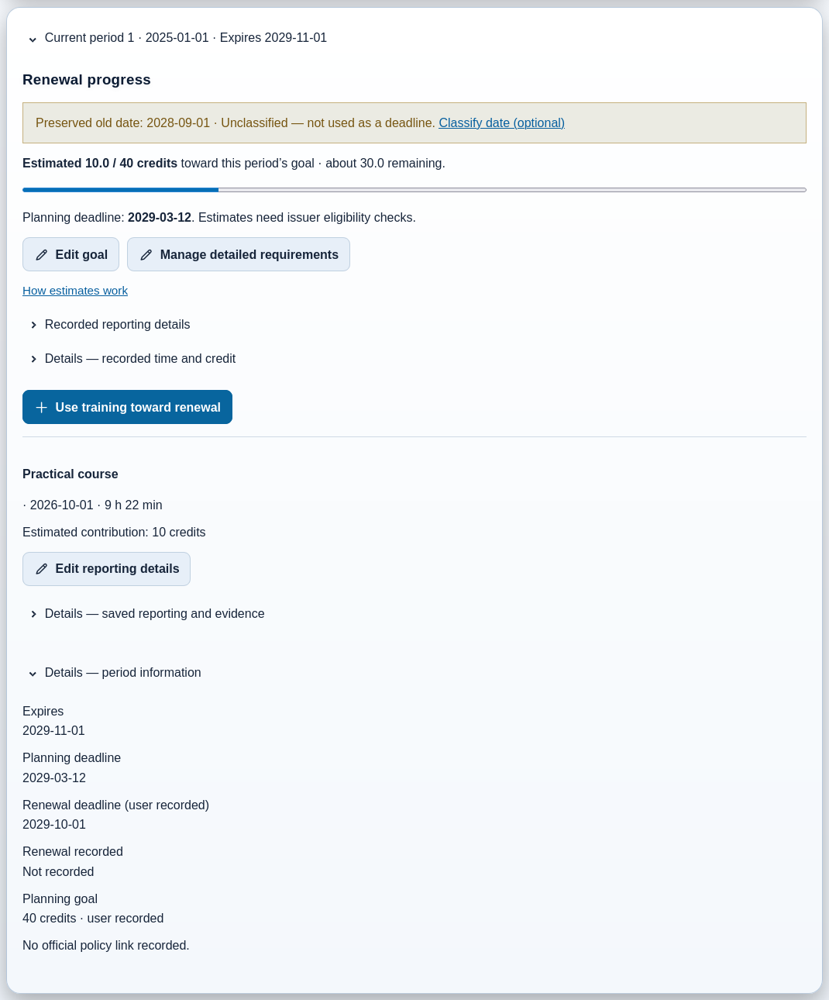
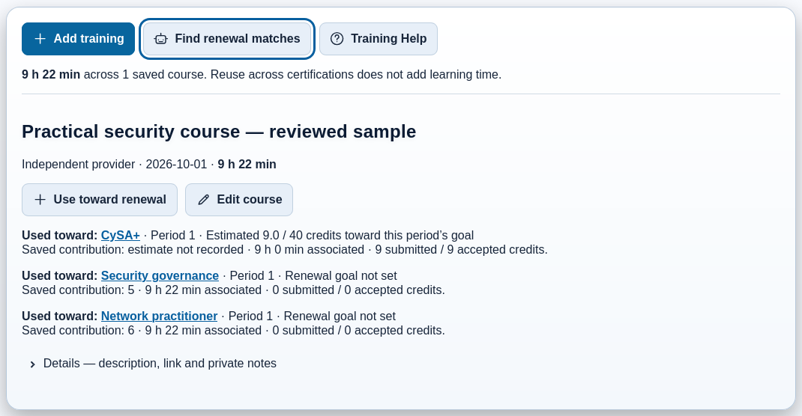

# My Certifications and Training library

Keep earned achievements and plan approximate renewals without administering a
rules engine. Use any free-text issuer; presets are optional starting points.
Exam preparation belongs in [Exam Plans](exam-plans.md), not the trophy case.

## Add or edit an earned credential

1. Open **My Certifications → Add certification**.
2. Enter name, issuer, **Originally earned** date and current **Expires** date,
   or choose **Does not expire**. Leave genuinely unknown information blank.
3. Optionally upload **Display badge/logo** and **Official certificate** separately.
4. Save. Requirements and period details can be added later.

**Edit certification** corrects the record/current period; it does not create a
renewal. Originally earned and current period start are different dates. Existing
uploads remain when no replacement is chosen. Replacing a logo does not replace
the official certificate. **View certificate** opens only current-period official
evidence; without it, use **Add certificate**. Ambiguous older attachment roles are
preserved for an explicit user choice rather than silently reclassified.

Earned achievements remain in the trophy case when expired or superseded, with
honest status labels. Non-expiring credentials are supported. The list can sort
by name, earned date or expiration; **Save order** persists the chosen order.

*Sample records, not issuer verification. A full progress bar is not approval or
automatic renewal.*

## Log a course

Open **Training library → Add training**. Enter title, provider, completion date,
**Hours** and **Minutes**. Evidence is optional; URLs, topics/descriptions and
private notes can stay under Details. Minutes must be a whole number from 0–59.
For example, **9 h 22 min** is saved as the exact **562 minutes**, not rounded to
nine hours. The library total counts an activity once even when it supports
several credentials. Advertised course length does not prove eligible credit.

Saved cards show title, provider, completion date, duration and actions; expand
long descriptions only when needed. **Replace certificate (optional)** retains
the saved file if no new upload is selected.

## Use a course toward selected renewals

1. On that course, choose **Use toward renewal**.
2. Select each credential you want to add or update. Current periods are the
   default; historical periods remain available under Details.
3. Review the editable **Estimated contribution**. A goal recorded in hours can
   start from course duration; other units/unknown conversions need your estimate.
4. Save the selected changes. Unchecked rows do not remove or change existing links.

**Already linked** shows the period and saved contribution. Removal is an explicit
separate action. A retry must not duplicate an allocation. One activity can
legitimately support several credentials when you explicitly record each link;
this does not multiply actual learning time.

Actual time, estimated contribution, submitted credit and **user-recorded accepted
credit** are distinct. Optional reporting details preserve partial acceptance,
categories, source/rationale and reporting dates. Never prefill acceptance from
an estimate. Changing a course from 9 h to 9 h 22 min does not silently change
an older linked 9 h contribution or manually entered submitted/accepted credit.
Progress does not add estimate + submitted + accepted as three activities.

## Dates and goals

Use **Set renewal goal** or **Edit goal** for target amount, unit, optional annual
goal and your personal **Planning deadline**. It does not change expiration,
record a renewal or clear hidden detailed requirements. **Manage detailed
requirements** is optional for known issuer rules, reporting years, categories,
caps, sources and verification status. Loading suggested requirements requires
explicit review before replacing saved custom values. Unknown rules stay unknown;
they are not zero requirements or completed compliance.

| Date | Meaning |
| --- | --- |
| **Planning deadline** | Your optional personal target; never an official period boundary. |
| **Renewal deadline (user recorded)** | A separately recorded due date, not automatically issuer-verified. |
| **Expires** | Certificate expiration; absent/unknown and non-expiring are different states. |

The progress summary uses Planning deadline first, then a recorded Renewal
deadline, then expiration, with the actual meaning labeled. Clearing one changes
only that field. Date-only values remain calendar dates across browser timezones.
Period details never rename a personal planning target as the period end.

Older shared dates remain **Unclassified — not used as a deadline** with original
provenance. **Classify date (optional)** opens the detailed editor, where **Classify this date** explicitly chooses one meaning; it does
not automatically copy the value into both fields. Previously overwritten dates
cannot be reconstructed without evidence. Leave an uncertain date unclassified.

Estimated annual/cycle progress is useful planning, not issuer approval. A
mandatory annual minimum differs from optional pacing. Reporting years use the
recorded definition, not an assumed calendar year. Category caps and recorded
period boundaries can limit included contributions without changing saved amounts.
Missing requirements offer **Set renewal goal**. A full bar does not establish
fees, membership, submissions, audits or other conditions are satisfied.

## Record an actual renewal

Choose **Manage certification → Record renewal** only after an actual renewal.
Check previous expiration, enter renewed expiration, and optionally the date
recorded and replacement certificate. Early recording is supported; known
coverage dates still must be coherent. Leave unknown effective dates blank.

The new period becomes current. Historical periods, training allocations and
documents remain; credits do not carry forward. Without a new certificate, the
current period shows **Add certificate**, not the old document. Earlier documents
remain labeled in history. **Correct historical details** is a different task;
conflicting edits explain the specific chronology conflict.

Manual **Renewal relationships** record direction, earning/renewing trigger,
supporting source and conditions for any saved issuers. Nothing renews
implicitly, in reverse or transitively. After issuer confirmation, explicitly
record the target renewal. No automatic CompTIA mapping or manufactured credit
is implied. LPIC certification validity and LPI membership/PDU rules are distinct;
optional presets must not conflate credential/version/route requirements.

## Find renewal matches

Select **Find renewal matches**. Current renewable credentials are initially
selected; exclude any before preparing text. Unknown-status records remain
available explicitly. Select courses for matching, or use no courses to ask only
about requirements. Selection itself creates no allocations.

Choose **Prepare prompt**, review/edit the preview, then **Copy & open [provider]**.
Paste the exact copied material into your chosen service yourself. **Copy only**
is independent. If copying fails, use manual Copy from the preview; if nothing
opens, use **Nothing opened, or need help copying? → Open AI manually**.
Copying and opening have separate truthful status messages; not every launch
failure can be detected. Ordinary LAN HTTP has a manual fallback.

Prepared context contains only selected relevant credential/rule information,
public course details and exact hours/minutes. Credential IDs, private notes,
attachments and extracted contents are excluded by default. Your own preview
edits are your choice. Provider URLs contain no personal prompt text. No background
AI/API call or automatic evidence upload occurs. Ask for official source URLs,
policy dates, uncertainty and missing information; AI suggestions are not issuer
acceptance and never change credits, dates or Study evidence.

**Settings → AI Integration** stores the shared selected provider and independently
editable portfolio, single-certification and Study prompt templates. Save edits;
a default control resets only its own template. This reuses Study question/answer
**Review with AI**, not a new provider integration.

## Display, evidence and safe recovery

**Display options** on the trophy case opens **Settings → Layout & navigation**.
**Show My Certifications** controls the feature's dashboard and sidebar entries,
including Training library. A separate dashboard panel choice affects only the
case. **Number to show** accepts All or a positive Custom count; **Sort order**
persists too. Limited grids offer **View all**. Hiding/re-enabling preserves records,
documents, historical periods, training, count and order. Settings always remains
reachable. See [Settings](16-settings-and-runtime.md).

Uploads support PNG/JPEG/WebP badge images and those images or PDFs as evidence,
with validation and size limits shown by the form. PDFs download for a local viewer;
HTML/SVG are not accepted. Missing evidence does not delete its record. Keep
originals separately; raster storage can normalize orientation and remove metadata.

Backups contain records and evidence. Restore is a full-profile snapshot replacement,
not a merge; old feature-less backups can restore an empty collection. Current
schema 10 cannot be reversed by replacing the binary. Keep a verified pre-upgrade
backup and follow [rollback guidance](17-maintenance-backup-and-data-management.md#restore-versus-application-rollback).
Scoped learning, Study-history, quiz-library and source resets preserve certifications;
fresh-state reset/removal does not. Removal requires confirmation. Failed/stale saves
need the displayed retry or a reopened current form, not clearing storage or resetting
learning. Reselect uploads after an error when required.
