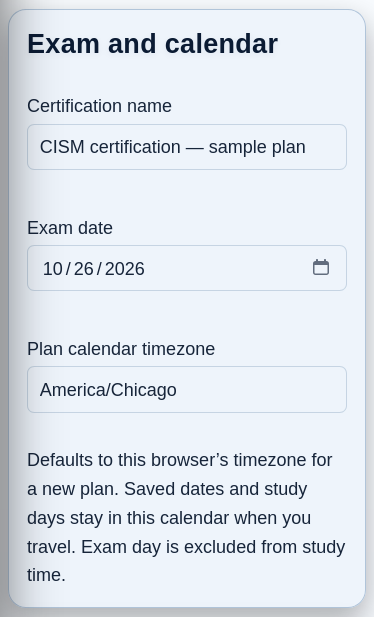

# Exam Plans: a manageable next study session

An Exam Plan helps you choose today's work within an estimated time budget.
It is optional preparation, not an earned credential or a prediction of passing.
Open **Learning Intelligence → Exam Plans → New exam plan**.

## Create a plan

1. Enter the certification name, **Exam date** and **Plan calendar timezone**.
2. Select exact folders under **Study material**. Folders are flat, not nested.
3. Choose **Study days** and **Minutes you plan to study on each selected day**.
4. Review the pace/review assumptions and preview. Resolve excluded or unavailable
   material notices rather than assuming every selected question is included.
5. Save. Optionally select **Use this plan on my dashboard**.

*The calendar timezone defaults from the creating browser. It stays saved when
you travel; activity timestamps use the viewing browser's local timezone.*

## Choose the dashboard plan

Several plans can be saved, but only one appears on the Dashboard. Selecting
**Use this plan on my dashboard** atomically makes that plan active and visible;
the screen identifies the plan being replaced. It does not unpause it. An
unchecked choice leaves dashboard selection/visibility unchanged, including
when editing a plan. **On dashboard** is a status, not another button.

**Hide from dashboard** changes visibility; **Pause suggestions** stops planned
recommendations. Ordinary edits do not switch plans. If the Study next panel
is hidden in Layout & navigation, follow the displayed Settings link to show it;
plan selection never overrides that preference. Deleting a plan is confirmed and
does not delete quizzes, Study facts or earned certifications.

## Start today's practice

In **Study next**, read the question count, approximate time and reasons, then
choose **Start suggested work**. **Why this suggestion?** explains the selected
batch. **View plan** opens progress, calendar, assumptions and other practice.
**More review options** remains available for eligible due/concept/adaptive work.
Last regular quiz and browser Resume remain separate from generated practice.

A selected question is counted once even if it is both missed and due. Where
supported by the evidence, the summary distinguishes no recorded answer,
previously reviewed material needing fresh evidence, first-response mistakes and
due reviews. No recorded answer is not proof the learner never saw the material.
Suggestions do not force every mistake into every batch: ranking and diversity
still apply. Starting a generated quiz earns no credit by itself.

## Understand progress and time estimates

**Included questions reviewed** is coverage, not mastery. Excluded questions are
shown separately; included-but-unavailable material stays visible in the scope
and denominator. Partial sessions, full reviews, focused sessions, assistance
and independent success are different facts. Wrong → correct retains the initial
miss. **Finish Review** completes only acknowledged coverage of that session.
Generated plan work is focused and never finishes an entire source quiz.

**Study time available** is calendar capacity. **Estimated work remaining** uses
editable assumptions, not measured activity time. Capacity ends the day before
the exam. Remaining study dates and minutes set the daily first-pass/fresh-evidence
target within the budget; remaining capacity can go to mistakes and due reviews.
Existing spaced intervals are never shortened to make the plan fit. Completed
work today reduces the target; refresh and generation do not award duplicate
credit or restart a full quota. Optional extra practice remains available where
eligible and does not spend a future day's allowance.

**Example:** you choose four study days and 30 minutes per day. The plan has
120 estimated minutes available before the exam. If known work is estimated at
150 minutes, the shortfall is about 30 minutes—even if today's practice is ready.
Open **Edit plan** to change your own budget or assumptions; DLMS does not move the
exam date. Unknown work makes the estimate less certain, not guaranteed to fit.

## When suggested work is unavailable

| State | What to do |
| --- | --- |
| No selected/included material | Edit Study material. Use the adjacent Learning Scope link for exclusions; DLMS never removes them automatically. |
| Included material is unavailable or changed | Review Changes to study material and source availability. Changed questions can need fresh evidence. |
| Suggestions paused | Resume suggestions when ready. Showing the plan does not unpause it. |
| Not a selected study day | “Suggestions follow your selected study days. Optional practice is available today.” Use eligible optional practice or the next saved-calendar study date. |
| Today's estimated allowance used | Continue optional practice if wanted; the next study day's budget remains separate. |
| Reviews are due later | Use the displayed next review date. It can differ from the next selected study day. |
| Exam is today/past, or no study dates remain | Edit the date or study days if your real plans changed; no silent rescheduling. |
| Request or generation failed | Use the displayed retry/recovery action. An uncertain generation is resolved before another quiz is silently created. |

## Changes, resets and recovery

Folder membership is live. Added/moved/deleted or materially edited questions
can change the plan's included material and evidence needs. A substantive folder
rename needs explicit remapping. Grouped change summaries retain bounded question
pages. **Mark these changes as seen** acknowledges only that displayed snapshot;
it grants no review credit and cannot acknowledge newer unseen changes.

Learning Scope exclusions always apply. Multiple plans can share source evidence
without duplicating curriculum questions or rewriting factual history. Learning
Intelligence reset preserves historical coverage but clears estimates; new evidence
can still be needed. Restore replaces the profile with the backed-up snapshot,
not a merge; an old snapshot may have no plans. Reload stale forms/tabs after
restore. See [backup and rollback](17-maintenance-backup-and-data-management.md).
